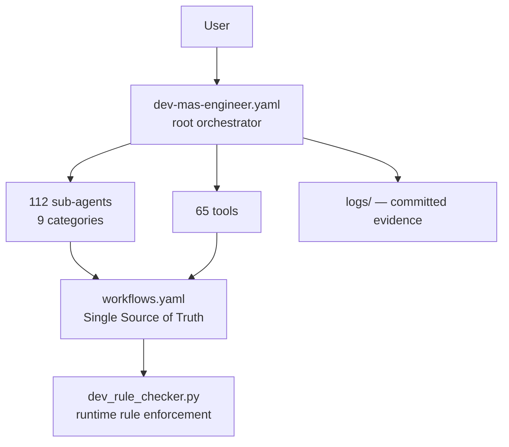

# MAS-Engineer

*A High-Confidence Architecture Lab for Multi-Agent Systems*

MAS-Engineer is a research-grade, self-improving multi-agent system that runs on the
[Goose](https://goose.ai) MCP agent runtime. It develops, verifies, monitors, and
recovers multi-agent systems — including itself — through natural-language
interaction. It is designed for researchers, scientists, and early adopters who
want a reproducible, inspectable platform for studying multi-agent architectures.

The system is intentionally **verification-oriented**: every claimed capability is
backed by committed test logs under `logs/` (the public evidence), a single source
of truth (SOT), and a runtime rule checker that enforces governance.

---

## What it does

MAS-Engineer does not require you to write agent code. You describe intent in natural
language; the system designs, generates, registers, and operates the agents.

Core capabilities:

- **Multi-agent system generation** — turn a natural-language description into a
  working team of specialized agents (112 sub-agents ship with the system).
- **Self-improvement** — an 8-stage improvement pipeline analyzes its own sessions,
  finds optimization candidates, designs and validates patches, and applies them.
- **Verification** — an end-to-end evidence trail (test logs, health reports,
  post-push audits) is committed to the repository as public proof of function.
- **Recovery** — a 5-stage recovery system (immune → checkpoint → safezone →
  timeline → defib) protects against corruption and partial failures.
- **Governance** — a constitution (11 articles) and a rule system (R01–R18 with
  hardness levels) are enforced at runtime, not merely documented.
- **Monitoring** — health reporting, session analysis, and a per-project dashboard.

The system operates in three modes, selected via `.mas-mode`:

| Mode | Value | Scope |
|------|-------|-------|
| MAS | `mas` | improves itself |
| Framework | `framework` | improves a user's multi-agent system |
| Generic | `<project>` | initializes and operates a new project |

## Verified state

The following numbers are the current, verified state of the codebase
(2026-08-07), reproduced by running the bundled verification suite:

| Metric | Value | Verification |
|--------|-------|--------------|
| Sub-agents | 112 | `python3 tools/test_subagents --all` |
| Tools | 65 (58 Python, 6 Shell, 1 YAML) | `ls mas-engineer/tools/` |
| Knowledge files | 9 | `.mase/knowledge/` |
| Skills | 20 | `.mase/skills/` |
| Rules | 16 active (R01–R18, hardness levels) | `.mase/rules/rules.yaml` |
| Unit tests | 1355 passed / 11 skipped | `pytest tests/` |
| E2E workflow tests | 131 / 131 | `python3 tools/e2e_run_all.py` |
| Secret scan | 0 hits (tracked + history) | `scripts/e2e-test.sh` |

Evidence logs are committed under `logs/` — they document each e2e run (recipe
loading, PTY tests, improvement rounds, team generation) and are the public,
inspectable proof of the claimed results.

## Architecture at a glance


```mermaid
flowchart TB
    YOU["User"] --> ME["dev-mas-engineer.yaml\nroot orchestrator"]
    ME --> AGENTS["112 sub-agents\n9 categories"]
    ME --> TOOLS["65 tools"]
    AGENTS --> SOT["workflows.yaml\nSingle Source of Truth"]
    TOOLS --> SOT
    SOT --> CHECKER["dev_rule_checker.py\nruntime rule enforcement"]
    ME --> LOGS["logs/ — committed evidence"]
```

The Single Source of Truth (`.mase/workflows.yaml`) defines every agent, rule,
workflow, signal, and path the system uses. The runtime rule checker enforces the
constitution and rules before every write/edit/shell action.

For developers, an **extremely detailed architecture and functional description**
lives in [`docs/dev/`](docs/dev/index.md), with diagrams covering the SOT schema,
the improvement pipeline, the recovery system, agent communication, the tool
system, and the directive workflow.

## Quick start

```bash
# 1. Install into the Goose runtime
./install.sh

# 2. Start a session
goose run --recipe dev-mas-engineer

# 3. Describe what you want, e.g.:
#   "Create a customer-support multi-agent system"
#   "Add a researcher agent that searches the web"
#   "Improve my agents' performance"
```

## Demo: try it yourself

After installing, start a session and paste this prompt verbatim. It builds a
working 3-agent customer-support team at `/tmp/support` — project skeleton,
agent YAMLs, orchestrator, MCP dashboard — and runs live validation:

```
Build a customer-support multi-agent team at /tmp/support with 3 agents:

1. intent-router      — classifies incoming messages as billing/technical/general
2. specialist-handler — resolves the issue based on the category
3. empathic-responder — formats the final customer-facing reply

Create the project skeleton, all agent YAMLs, the orchestrator recipe, set up
the MCP dashboard, and run live validation. Report the results.
```

The system generates all files, registers the agents in the SOT, and reports
pass/fail for every check. This prompt pattern is verified — 9/9 successful
team-generation runs across different team types (sales, marketing, translator)
are documented under [`logs/e2e-results/2026-07-24-demo-team-generation-rate/`](logs/e2e-results/2026-07-24-demo-team-generation-rate/).

See [`docs/installation.md`](docs/installation.md) for details.

## Documentation

- [Documentation index](docs/index.md)
- [Developer docs (architecture, pipeline, recovery)](docs/dev/index.md)
- [Agent catalog](docs/agents.md)
- [Rules & governance](docs/governance.md)

## Requirements

- Goose (MCP agent runtime)
- Python 3.10+ with `pyyaml`
- Node.js 18+ (optional, for the dashboard)
- An LLM provider supported by Goose (OpenAI-compatible, e.g. DeepSeek, or local
  via Ollama)

## License

Released under the **GNU Affero General Public License v3.0** (AGPL-3.0).
