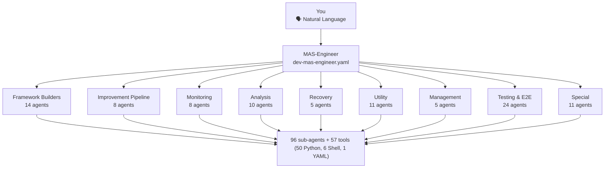
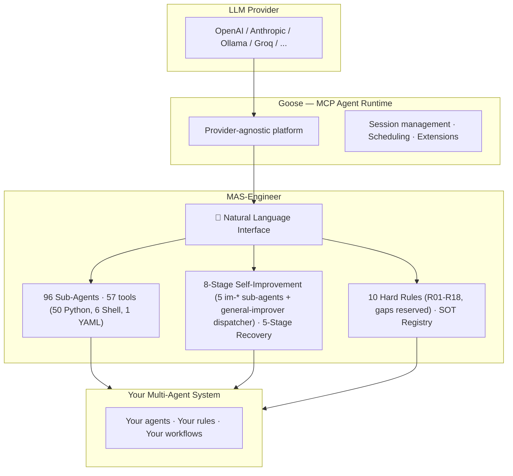
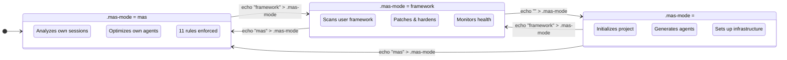
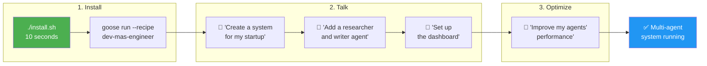
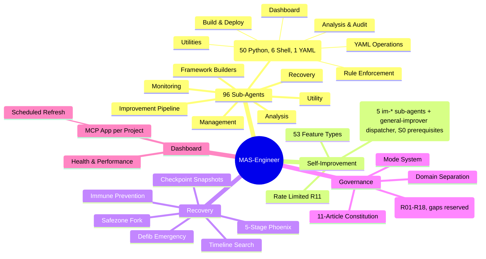

<p align="center">
  <br>
  
  <br>
  <h1 align="center">MAS-Engineer</h1>
  <h3 align="center">Build Multi-Agent Systems by Talking, Not Coding</h3>
<p align="center">
  <em>The world's first natural-language Multi-Agent System generator.<br>
  Ships with 96 sub-agents, 8-stage self-improvement pipeline (5 im-* sub-agents + general-improver dispatcher + S0 prerequisites), and 5-stage recovery.<br>
  You bring the idea. It builds the system.</em>
</p>
</p>

<p align="center">
  <a href="#quick-start">⚡ Quick Start</a> •
  <a href="#what-makes-it-different">🆚 Why It Exists</a> •
  <a href="#overview">🎬 Demo</a> •
  <a href="#use-cases">💼 Use Cases</a> •
  <a href="#philosophy">🧠 Philosophy</a>
</p>

<p align="center">
  
  
  
  
  
  
</p>

---

## 📊 Verified Track Record (as of 2026-07-24)

Every claim below is backed by a raw log on disk in this repository, not a curated summary.

| What was verified | Result | Where the evidence lives |
|--------------------|--------|--------------------------|
| **Demo-Team generation from natural language** (R38) | 9/9 successful runs across different team types (sales, marketing, translator) | `logs/e2e-results/2026-07-24-demo-team-generation-rate/` — `raw-results.json` + per-team logs |
| **End-to-end infrastructure tests** (R39) | 8/8 PASS (100 %) — recipe-yaml, top-workflows, recovery-workflows | `logs/e2e-results/2026-07-24-run-3/raw-results.json` (post-cleanup run) |
| **Pre-push validation** (every commit) | 11/11 PASS — P1 findings, paths, syntax, secrets, e2e-regression, constitution | `.state/pipeline/pre_push_validation.yaml` (regenerated each push) |
| **Dogfooded user-bug fixes** (R37) | 2 real user-reported bugs fixed (F-BUG-001, F-BUG-002) | commit `b7e1264` |

**What the numbers mean, in plain language:**
- The 9/9 figure is the strongest single piece of evidence that the core promise — "give MAS-Engineer a description, get a working multi-agent team" — actually holds up under repeated runs on the same day with the same model. It is not yet a cross-day, cross-model robustness claim.
- The 8/8 and 11/11 figures are about the framework's own plumbing, not about user-facing team generation.
- The 2 dogfooded bugs are the first time the project ate its own cooking on real user input, not synthetic test cases.

For full traceability, see the commit graph (`git log --oneline`) and the `logs/e2e-results/` directory.

---

## 🚀 TL;DR — Core System Ready in 10 Seconds (Dashboard optional via npm)

```bash
./install.sh                    # → Installs into Goose
goose run --recipe dev-mas-engineer  # → Start talking
# Then:
# "Create a multi-agent system for my startup"
# "Researcher, writer, and reviewer agents"
# "Set up the dashboard"
# Done.
```

**No Python. No APIs. No framework tutorials. Just conversation.**

---

## ⏱️ Before vs After — What Changes

| Task | With Code-Based Frameworks | With MAS-Engineer |
|------|---------------------------|-------------------|
| Install + configure | 30 min reading docs + setup | `./install.sh` (10 seconds) |
| First agent | Write 20+ lines of Python | "Create me a researcher agent" |
| All agents | Classes, tasks, crews, tools | Conversation. The engineer creates them. |
| Monitoring | Hours setting up infrastructure | Included. Runs automatically. |
| Recovery from crash | Build your own retry/rollback | 5-stage system. Auto-activated. |
| Performance dashboard | Enterprise plan ($$$) | Free. Per project. MCP app. |
| Self-improvement | Not possible. Framework doesn't know itself. | 8-stage pipeline (S1-S8, with S0 prerequisites). Five `im-*` sub-agents (`im-session-reader`, `im-finder`, `im-rank`, `im-designer`, `im-validator`) do the work; `general-improver` is the dispatcher. Analyzes + fixes itself. |

**Time to first result: 1 workday → 1 coffee break.**


```mermaid
gantt
    title Before vs After — What Changes
    dateFormat mm
    axisFormat %m min

    section Code-Based Frameworks
    Install + configure docs     :a1, 0, 30
    Write first agent class      :a2, after a1, 45
    Build all agents             :a3, after a2, 180
    Set up monitoring/logging    :a4, after a3, 120
    Build recovery/retry logic   :a5, after a4, 120
    Set up dashboard             :a6, after a5, 60
    Done                         :milestone, after a6, 0

    section MAS-Engineer
    ./install.sh                 :b1, 0, 1
    "Create me a system"          :b2, after b1, 2
    Add researcher + writer       :b3, after b2, 2
    Set up dashboard              :b4, after b3, 1
    Improve performance           :b5, after b4, 5
    Done                          :milestone, after b5, 0
```

---

## ❌ What You Never Need to Touch

| **Don't Need** | **MAS-Engineer Handles It** |
|----------------|----------------------------|
| 🐍 Python knowledge | Talk naturally. It writes the YAML. |
| 📖 Framework API docs | 96 sub-agents already know their jobs. |
| 🔧 Editing config files | Conversation → automatic generation. |
| 📊 Dashboard setup | One command. Per project. Forever. |
| 🔄 CI/CD for agents | Auto-commit, auto-checkpoint, auto-improve. |
| 🧪 Writing tests | Test runner + verification agent included (add your own test suites). |
| 📚 Framework tutorials | Just talk to it. It explains itself. |

---

## 🤬 Building Multi-Agent Systems Today Sucks

You want a multi-agent system. Here's what that means today:

**1. Learn a framework** — CrewAI, LangGraph, AutoGPT. Each has its own concepts, APIs, and gotchas.

**2. Write Python code** — Agent classes, task definitions, tool integrations, crew orchestration. Hours of coding before you see anything work.

**3. Design every agent yourself** — Roles, goals, prompts, settings, backstories. Starting from a blank file every time.

**4. Figure out monitoring** — Health checks, logging, dashboards, alerts. None of the frameworks ship this — you build it.

**5. Build recovery yourself** — Retry logic, checkpointing, rollbacks, fallbacks. One crash and you're debugging.

**6. Accept your system stays static** — It never improves. Never learns from its own sessions. Never optimizes its own agents. What you built on day one is what it does forever.

**Days of work. For a system that never gets better.**

---

## 🦆 Enter MAS-Engineer

The same result. **Done through conversation.**

```
┌─ You ─────────────────────────────────────────┐
│                                                │
│   "Create a customer support agent system"      │
│                                                │
├─ MAS-Engineer ─────────────────────────────────┤
│                                                │
│   ✅ Project initialized. Base agent created.  │
│   💡 Should I research current techniques?     │
│                                                │
├─ You ─────────────────────────────────────────┤
│                                                │
│   "Yes, search for best practices"              │
│                                                │
├─ MAS-Engineer ─────────────────────────────────┤
│   🔍 Web research complete. 3 findings:        │
│     • Multi-agent patterns (high relevance)     │
│     • Recent LLM capabilities (medium)          │
│     • Security best practices (high)            │
│   What should I integrate?                     │
│                                                │
├─ You ─────────────────────────────────────────┤
│                                                │
│   "Add a researcher agent that searches the web"│
│                                                │
├─ MAS-Engineer ─────────────────────────────────┤
│                                                │
│   ✅ Agent 'researcher' created.               │
│   ✅ Registered in workflows.yaml.             │
│   ✅ Added to sub_recipes.                     │
│   ✅ SOT entry created.                        │
│                                                │
├─ You ─────────────────────────────────────────┤
│                                                │
│   "Add a writer agent for responses"            │
│                                                │
├─ MAS-Engineer ─────────────────────────────────┤
│                                                │
│   ✅ Agent 'writer' created and registered.    │
│                                                │
├─ You ─────────────────────────────────────────┤
│                                                │
│   "Set up the dashboard"                       │
│                                                │
├─ MAS-Engineer ─────────────────────────────────┤
│                                                │
│   📊 Dashboard active. Refreshable via Goose   │
│      scheduler. Health, agents, changes visible. │
│                                                │
├─ You ─────────────────────────────────────────┤
│                                                │
│   "Improve my agents' performance"              │
│                                                │
├─ MAS-Engineer ─────────────────────────────────┤
│                                                │
│   🔄 8-stage improvement pipeline running...   │
│   ✅ 3 patches applied.                        │
│   ✅ Prompt score: 6.2 → 8.1/10               │
│   ✅ Guardian: no new drifts detected          │
│                                                │
└────────────────────────────────────────────────┘

**Time invested: a few minutes of conversation.**
**96 sub-agents did the work behind the scenes.**
```

<p align="center">
  <b>Zero code. Zero configuration. Zero framework tutorials.</b><br>
  <i>From idea to running multi-agent system in the time it takes to have a coffee.</i>
</p>

---

## 🎁 What MAS-Engineer Ships

<p align="center">
  <table>
    <tr>
      <td align="center"><h2>🛡️</h2><b>96</b><br>Ready-to-Use<br>Sub-Agents</td>
      <td align="center"><h2>🔧</h2><b>57</b><br>Tools (50 Python,<br>6 Shell, 1 YAML)<br><sub>(npm install needed)</sub></td>
      <td align="center"><h2>🔄</h2><b>8</b><br>Stage Self-<br>Improvement<br>(5 im-* agents<br>+ dispatcher)<br><sub>(E2E-tested)</sub></td>
      <td align="center"><h2>🏥</h2><b>5</b><br>Stage<br>Recovery<br><sub>(designed)</sub></td>
      <td align="center"><h2>📊</h2><b>Free</b><br>Dashboard<br>Per Project</td>
      <td align="center"><h2>📜</h2><b>10</b><br>Active Hard<br>Rules<br><sub>(R01-R18, gaps reserved)</sub></td>
    </tr>
  </table>
</p>

---

## 🆚 Why MAS-Engineer Exists

**Because building a multi-agent system shouldn't require a software engineering degree.**

| | **Code-Based Frameworks** (CrewAI, AutoGPT, LangGraph) | **MAS-Engineer** |
|---|---|---|
| **How you build agents** | 🐍 Python: `Agent(role=..., goal=...)` | 🗣️ "Create me a researcher agent" |
| **Agents out of the box** | **0** — you build everything | **96** — production-ready sub-agents across 9 categories |
| **Self-improvement** | ❌ Your system stays the same forever | ✅ Analyzes itself, improves its agents |
| **Recovery from failure** | `max_retry_limit=2` | ✅ 5 stages: Immune→Checkpoint→Safezone→Timeline→Defib |
| **Per-project dashboard** | Enterprise plan 💰 | ✅ Free, refreshable, every project |
| **Enforced governance** | Manual coding of guardrails | ✅ 11-article Constitution + 10 hard Rules (R01-R18, gaps reserved) |
| **Framework generator** | ❌ | ✅ `--bootstrap` recipe (DEPLOY) + `--package-team` recipe (PACKAGE_TEAM) — *recipe-only, E2E test pending* |
| **Who it's for** | Python developers who love APIs | **Anyone who needs an agent system** |

---

## 🆚 Head-to-Head with the Market

| | **MAS-Engineer** | CrewAI | MetaGPT | AutoGPT | LangGraph |
|---|---|---|---|---|---|
| **Natural Language Interface** | ✅ Core design | ❌ | ✅ CLI only | ❌ | ❌ |
| **Pre-built Agents** | 96 | 0 | 5 roles | 0 (builder) | 0 |
| **Self-Improvement** | ✅ 8-stage pipeline (5 im-* sub-agents + general-improver dispatcher, E2E-tested) | ❌ | ❌ | ❌ | ❌ |
| **Recovery System** | ✅ 5 stages (designed) | ❌ | ❌ | ❌ | ❌ |
| **Framework Bootstrap** | Recipe-defined, E2E test pending | ❌ | ❌ | ❌ | ❌ |
| **Dashboard per System** | ✅ Free MCP app (needs `npm install`) | 💰 AMP | ❌ | Built-in | LangSmith |
| **Constitution + Rules** | ✅ 11 art. + 10 hard rules (R01-R18, gaps reserved) | Guardrails (limited) | ❌ | ❌ | ❌ |
| **Install** | `./install.sh` | `pip install` | `pip install` | Docker | `pip install` |
| **GitHub Stars** | New project, zero so far | 54k | 69k | 185k | 36k |

---

## 🧠 How It Works


```mermaid
flowchart TD
    YOU["You\n🗣️ Natural Language"] --> ENGINEER["MAS-Engineer\ndev-mas-engineer.yaml"]
    ENGINEER --> FB["Framework Builders\n14 agents"]
    ENGINEER --> IP["Improvement Pipeline\n8 agents"]
    ENGINEER --> MON["Monitoring\n8 agents"]
    ENGINEER --> AN["Analysis\n10 agents"]
    ENGINEER --> REC["Recovery\n5 agents"]
    ENGINEER --> UT["Utility\n11 agents"]
    ENGINEER --> MG["Management\n5 agents"]
    ENGINEER --> TEST["Testing & E2E\n24 agents"]
    ENGINEER --> SPEC["Special\n11 agents"]
    FB & IP & MON & AN & REC & UT & MG & TEST & SPEC --> TOOLS["96 sub-agents + 57 tools (50 Python, 6 Shell, 1 YAML)"]
```

---

## 🧩 Where MAS-Engineer Fits in Your Stack


```mermaid
flowchart TB
    subgraph LLM["LLM Provider"]
        L1["OpenAI / Anthropic / Ollama / Groq / ..."]
    end
    subgraph GOOSE["Goose — MCP Agent Runtime"]
        G1["Provider-agnostic platform"]
        G2["Session management · Scheduling · Extensions"]
    end
    subgraph ENGINEER["MAS-Engineer"]
        E1["🧠 Natural Language Interface"]
        E2["96 Sub-Agents · 57 tools (50 Python, 6 Shell, 1 YAML)"]
        E3["8-Stage Self-Improvement (5 im-* sub-agents + general-improver dispatcher) · 5-Stage Recovery"]
        E4["10 Hard Rules (R01-R18, gaps reserved) · SOT Registry"]
    end
    subgraph SYSTEM["Your Multi-Agent System"]
        S1["Your agents · Your rules · Your workflows"]
    end
    L1 --> G1 --> E1
    E1 --> E2 & E3 & E4
    E2 & E3 & E4 --> SYSTEM
```

MAS-Engineer sits between your LLM provider and your multi-agent system. Goose handles runtime. MAS-Engineer handles **creation, optimization, monitoring, and recovery** through natural language.

---

## 🔄 Three Operating Modes


```mermaid
stateDiagram-v2
    direction LR
    state ".mas-mode = mas" as MAS
    state ".mas-mode = framework" as FW
    state ".mas-mode = <project>" as GEN

    [*] --> MAS
    MAS --> FW: echo "framework" > .mas-mode
    FW --> GEN: echo "<project>" > .mas-mode
    GEN --> FW: echo "framework" > .mas-mode
    FW --> MAS: echo "mas" > .mas-mode
    GEN --> MAS: echo "mas" > .mas-mode

    state MAS {
        M1 : Analyzes own sessions
        M2 : Optimizes own agents
        M3 : 11 rules enforced
    }
    state FW {
        F1 : Scans user framework
        F2 : Patches & hardens
        F3 : Monitors health
    }
    state GEN {
        G1 : Initializes project
        G2 : Generates agents
        G3 : Sets up infrastructure
    }
```

One tool. Three completely different jobs. All through natural language.

---

## ⚡ Quick Start

```bash
# 1. Clone or unzip
cd <repo>

# 2. Install into Goose (your MCP agent platform)
./install.sh

# 3. Start Goose
goose run --recipe dev-mas-engineer

# 4. Start talking
# → "What can you do?"
# → "Create a new multi-agent system"
# → "Add a researcher agent"
# → "Set up the dashboard"
```


```mermaid
flowchart LR
    subgraph INSTALL["1. Install"]
        A["./install.sh\n10 seconds"] --> B["goose run --recipe\ndev-mas-engineer"]
    end
    subgraph TALK["2. Talk"]
        B --> C["💬 'Create a system\nfor my startup'"]
        C --> D["💬 'Add a researcher\nand writer agent'"]
        D --> E["💬 'Set up\nthe dashboard'"]
    end
    subgraph IMPROVE["3. Optimize"]
        E --> F["💬 'Improve my agents'\nperformance'"]
    end
    F --> G[✅ Multi-agent\nsystem running]
    style A fill:#4CAF50,color:#fff
    style G fill:#2196F3,color:#fff
```

---

## 🎁 What's Included

| | Feature | What It Does |
|---|---|---|
| 🛡️ | **96 Sub-Agents** | Monitoring, Recovery, Improvement, Analysis, Management, Documentation, Utilities — YAML-defined; core IM-pipeline E2E-tested via `logs/e2e-results/2026-07-19/` |
| 🔄 | **8-Stage Self-Improvement** | IM pipeline: 5 `im-*` sub-agents (`im-session-reader` → `im-finder` → `im-rank` → `im-designer` → `im-validator`) in an 8-stage orchestrator flow (S1-S8 with S0 prerequisites), plus `general-improver` dispatcher. 53 documented patterns. |
| 🏥 | **5-Stage Phoenix Recovery** | Immune (prevention) → Checkpoint (snapshots) → Safezone (isolated fork) → Timeline (best-point search) → Defib (emergency minimal config) |
| 📊 | **Per-Project Dashboard** | MCP app with health status, agent list, change history, performance metrics. Refreshable via Goose scheduler. Free. |
| 📜 | **Constitution + Rules** | 11 articles governing ALL agents + 10 hard rules (R01-R18, gaps reserved) |
| 🚀 | **Bootstrap Deployment** | `sub_mas-bootstrap` (DEPLOY) and `sub_mas-team-packager` (PACKAGE_TEAM) recipes exist to bundle MAS-Engineer or a single team for distribution. **Recipe-defined, E2E test still pending** — see [HOWTO-PACKAGE-TEAM.md](mas-engineer/docs/HOWTO-PACKAGE-TEAM.md) for the design. |
| 🔍 | **Web Research** | Before creating or improving, searches goose-docs.ai, GitHub, and PyPI for current best practices |
| 🤝 | **R18 Delegation** | If a sub-agent can handle the task, the Engineer MUST delegate. No re-inventing wheels. |
| 📝 | **Auto-Documentation** | Every change logged to `changes.json`. Every operation auto-committed to git. Every session analyzed for improvement. |

---

## 💼 Who Is This For?

| Use Case | How MAS-Engineer Helps |
|----------|------------------------|
| 🏢 **Enterprise** | Deploy internal agent systems for HR, support, analytics, code review — without a dedicated AI engineering team |
| 🧪 **Research** | Start from 96 sub-agents. Experiment with self-improving architectures. Measure before/after scores. Publish. |
| 🚀 **Startups** | Prototype AI agent products in minutes. Use the `sub_mas-team-packager` recipe (recipe-defined, E2E test pending) to package a team. Iterate by conversation, not code commits. |
| 🎓 **Education** | Learn multi-agent systems by seeing 96 real, working implementations. Understand delegation, recovery, governance through practice. |

---

## 🧠 The Philosophy

MAS-Engineer is built on five beliefs:

1. **Agents should be created by conversation, not configuration.** Natural language is the most intuitive interface.

2. **Systems should improve themselves.** If a framework can analyze its own sessions and optimize its own agents, it should.

3. **Recovery should be automatic, not manual.** Five stages of protection ensure you never lose work.

4. **96 well-designed sub-agents are better than an empty SDK.** You shouldn't start from zero. You should start from a complete, working system.

5. **Rules should be enforced, not suggested.** If a rule matters, it should be enforced at runtime — not written in a best-practices document.

---

## 📚 Documentation

| Document | What It Covers |
|----------|---------------|
| [Documentation Index](docs/index.md) | All docs at a glance |
| [Installation & Setup](docs/installation.md) | Install, configure, update, uninstall |
| [Architecture Overview](docs/architecture.md) | Agent hierarchy, communication protocol, SOT, rules, tools |
| [Usage Guide](docs/usage.md) | Create, improve, monitor, repair, migrate, deploy |
| [Agent Catalog](docs/agents.md) | All 96 sub-agents with tasks and delegation relationships |
| [Improvement Pipeline](docs/improvement-pipeline.md) | The 8-stage self-improvement system (S1-S8 with S0 prerequisites; 5 im-* sub-agents: im-session-reader, im-finder, im-rank, im-designer, im-validator — plus general-improver dispatcher) |
| [Recovery System](docs/recovery-system.md) | 5-stage Phoenix recovery in detail |
| [Dashboard Setup](docs/dashboard.md) | Per-project MCP dashboard installation |

---

---

## ❓ FAQ

**Q: Why not just use CrewAI?**  
A: CrewAI is a Python SDK. You write code. MAS-Engineer is a conversational assistant. You talk. If you love coding and want full API control, CrewAI is great. If you want results without coding, MAS-Engineer is the only option that works this way.

**Q: Is this production-ready?**  
A: This is a **High-Confidence Architecture Lab**. It demonstrates a verified, self-improving multi-agent system running on Goose. The core system installs and runs. The MCP dashboard server requires `npm install` (not available in all sandbox environments). See the [logs/e2e-results](logs/e2e-results/) folder for documented test evidence, including how a `401 Unauthorized` failure was caught, documented, and resolved in the follow-up run.

**Q: Where can I see evidence of how this project handles test failures?**  
A: See [`logs/e2e-results/2026-07-19-demo-runner-ARCHIVED-script-failure/`](logs/e2e-results/2026-07-19-demo-runner-ARCHIVED-script-failure/). That folder preserves a 2026-07-19 e2e test that was originally reported as "15/15 PASS" but had actually produced 5 consecutive `401 Unauthorized` responses because the wrapper script passed a REDACTED API key placeholder to goose. The same folder contains `TRUTHFUL_REPORT.md` which documents the failure and explains the script-vs-manual distinction. The successful follow-up test is at `logs/e2e-results/2026-07-19-demo-runner-v2/`.

**Q: Can I use my own LLM?**  
A: Yes. MAS-Engineer runs on Goose, which supports OpenAI, Ollama (local), Groq, DeepSeek, and any OpenAI-compatible provider.

**Q: How is this different from AutoGPT?**  
A: AutoGPT is a single autonomous agent. MAS-Engineer is 96 sub-agents working together. AutoGPT executes tasks. MAS-Engineer **builds and maintains complete multi-agent systems**.

**Q: Can I extend it?**  
A: Yes. Add new sub-agents by creating YAML files. Register them in workflows.yaml. The Engineer discovers them automatically. Or talk to the Engineer: "I need a new agent that monitors database performance" — it delegates to `intention-parser` and `recipe-designer`.

**Q: How many systems can I manage?**  
A: Unlimited. Each project has its own `.mas-mode` file. You switch between them by changing modes. Each gets its own dashboard, monitoring, and improvement pipeline.

**Q: Does it work with any Goose configuration?**  
A: Yes. Standard Goose setup. Provider-agnostic. Configured via `~/.config/goose/config.yaml` as usual.

---

## 🗺️ Current Feature Set


```mermaid
mindmap
  root((MAS-Engineer))
    96 Sub-Agents
      Framework Builders
      Improvement Pipeline
      Monitoring
      Recovery
      Analysis
      Utility
      Management
     57 total (50 Python, 6 Shell, 1 YAML)
      Rule Enforcement
      YAML Operations
      Build & Deploy
      Analysis & Audit
      Dashboard
      Utilities
    Self-Improvement
      8-Stage Pipeline (5 im-* sub-agents + general-improver dispatcher, S0 prerequisites)
      53 Feature Types
      Rate Limited R11
    Recovery
      5-Stage Phoenix
      Immune Prevention
      Checkpoint Snapshots
      Safezone Fork
      Timeline Search
      Defib Emergency
    Governance
      10 Hard Rules (R01-R18, gaps reserved)
      11-Article Constitution
      Mode System
      Domain Separation
    Dashboard
      MCP App per Project
       Scheduled Refresh
      Health & Performance
```

---

## 🤝 Contributing

MAS-Engineer is a single-developer project with an ambitious vision. Contributions welcome:

- **Found a bug?** Open an issue
- **Want a feature?** Start a discussion
- **Want to contribute code?** Fork and submit a PR

---

## 📄 License

MAS-Engineer is released under the **GNU Affero General Public License v3.0** (AGPL-3.0).

---

<p align="center">
  <br>
  <h2 align="center">Ready to stop coding agents and start talking to them?</h2>
  <br>
  <p align="center">
    <code>cd &lt;repo&gt; && ./install.sh && goose run --recipe dev-mas-engineer</code>
  </p>
  <p align="center">
    <b>96 sub-agents are waiting. What do you want to build?</b>
  </p>
  <br>
</p>
