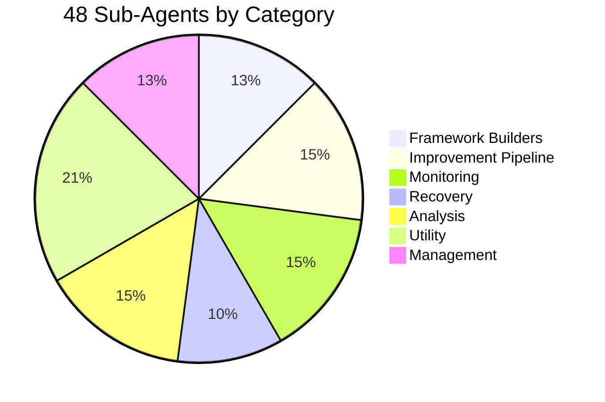
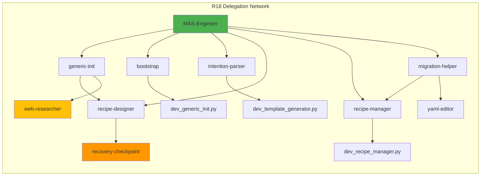
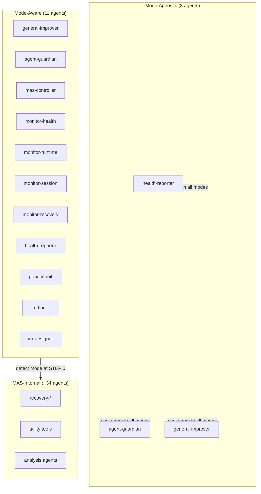
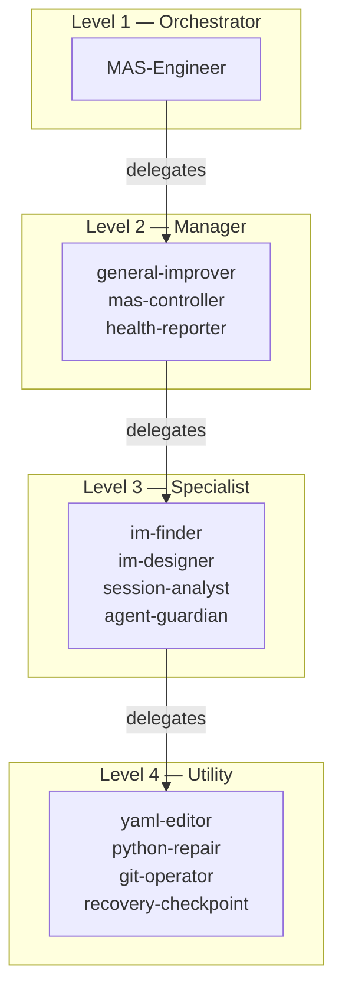

# Agent Catalog

MAS-Engineer contains 48 sub-agents, organized into functional categories.

---

## Framework Builders (6 agents)

Create, initialize, and deploy multi-agent systems.

| Agent | Task | Delegates To |
|-------|------|:------------:|
| `sub_mas-generic-init` | Initialize new projects (lightweight, symlink-based) | recipe-designer, web-researcher |
| `sub_mas-bootstrap` | Deploy MAS-Engineer as standalone distribution (all 48 agents) | dev_generic_init.py |
| `sub_mas-intention-parser` | Parse natural language → agent YAML | dev_template_generator.py |
| `sub_mas-recipe-designer` | Create new sub-agents from template | recovery-checkpoint |
| `sub_mas-recipe-manager` | Install/uninstall/list recipes | dev_recipe_manager.py |
| `sub_mas-migration-helper` | Migrate frameworks between versions | recipe-manager, yaml-editor |

---

## Improvement Pipeline (7 agents)

The self-improvement system. Analyzes sessions, detects issues, designs patches, validates.

| Agent | Task | Delegates To |
|-------|------|:------------:|
| `sub_mas-general-improver` | Orchestrate the 8-stage improvement pipeline | ALL im-* agents, yaml-editor, web-researcher, generic-init |
| `sub_mas-im-session-reader` | Read Goose session DB with 3-level project filter | (none) |
| `sub_mas-im-finder` | Detect optimization potential (53 feature types) | (none) |
| `sub_mas-im-rank` | Prioritize findings, check Constitution, deduplicate | (none) |
| `sub_mas-im-designer` | Convert findings into concrete YAML patches | (none) |
| `sub_mas-im-validator` | Validate changes, compare before/after scores | prompt-engineer, agent-guardian |
| `sub_mas-web-researcher` | Search for current MAS techniques | (none) |

---

## Monitoring (7 agents)

Continuous health monitoring and reporting.

| Agent | Task | Delegates To |
|-------|------|:------------:|
| `sub_mas-mas-controller` | Schedule-driven cycle (every 5 min), dispatches all monitors | monitor-health, monitor-runtime, monitor-session, monitor-recovery |
| `sub_mas-monitor-health` | Framework integrity (YAML, config, invariants, governance) | (none) |
| `sub_mas-monitor-runtime` | Runtime status (sessions, stale, crash, arch violations) | (none) |
| `sub_mas-monitor-session` | Cycle logging, session reports, dashboard data | (none) |
| `sub_mas-monitor-recovery` | Restart dead/timeout/looping agents (max 3 attempts) | (none) |
| `sub_mas-agent-guardian` | Agent health, drift detection, schema compliance, death/loop | degradation-handler |
| `sub_mas-health-reporter` | Daily health reports (git, rule-checker, trends) | git-operator, python-repair, doc-writer, json-utility, yaml-editor, recovery-checkpoint |

---

## Analysis (7 agents)

Framework understanding, scanning, and verification.

| Agent | Task | Delegates To |
|-------|------|:------------:|
| `sub_mas-framework-scanner` | Run observer + architect + analyst tools | (none, has fallbacks) |
| `sub_mas-framework-knowledge` | Dynamic framework structure discovery | yaml-editor |
| `sub_mas-config-auditor` | 16 cross-reference checks (config ↔ docs ↔ recipes ↔ runtime) | (none) |
| `sub_mas-prompt-engineer` | 10-criteria prompt quality check & optimization | web-researcher |
| `sub_mas-goose-expert` | 14-scope Goose rule compliance check | web-researcher |
| `sub_mas-session-analyst` | Session correlation with framework changes | test-runner (optional) |
| `sub_mas-test-runner` | pytest execution, regression detection | (none) |

---

## Recovery (5 agents)

The Phoenix Recovery system — 5 stages of protection.

| Agent | Task | Delegates To |
|-------|------|:------------:|
| `sub_mas-recovery-immune` | Coronashield: check YAML/Python/Shell before any change | (none) |
| `sub_mas-recovery-checkpoint` | Create/restore git-like snapshots | (none) |
| `sub_mas-recovery-safezone` | Create isolated fork workspace | (none) |
| `sub_mas-recovery-timeline` | Find best checkpoint, restore, analyze damage | recovery-checkpoint |
| `sub_mas-recovery-defib` | Emergency revival with minimal config | recovery-timeline, recovery-checkpoint |

---

## Utility Tools (10 agents)

Operational workhorses for common tasks.

| Agent | Task | Delegates To |
|-------|------|:------------:|
| `sub_mas-yaml-editor` | Safe YAML editing (backup → patch → validate → rollback) | dev_editor.py |
| `sub_mas-git-operator` | Git init, add, commit, status, log, diff | (none) |
| `sub_mas-python-repair` | Python code compile, fix, analyze, validate | (backup delegation) |
| `sub_mas-doc-writer` | Markdown create, update, link check | (backup delegation) |
| `sub_mas-json-utility` | JSON validate, format, append | (backup delegation) |
| `sub_mas-worktree-manager` | Git worktree lifecycle | (none) |
| `sub_mas-verification-runner` | Post-commit test execution (max 3 attempts) | (none) |
| `sub_mas-signal-generator` | Generate CP_DONE/ERROR/SESSION_END signals | (none) |
| `sub_mas-summarizer` | Consolidate executor summaries, format reports | (none) |
| `sub_mas-interpreter` | Parse user intent, task type, scope | (none) |

---

## Management (6 agents)

Administration and system operation.

| Agent | Task | Delegates To |
|-------|------|:------------:|
| `sub_mas-goose-admin` | Manage Goose components (sessions, skills, logs) | dev_goose_manager.py |
| `sub_mas-workflow-engine` | Execute SOT workflows (11 action types) | ANY sub-agent |
| `sub_mas-master-constitution` | Central rules for ALL 47 agents (11 articles) | (none) |
| `sub_mas-system-knowledge` | Auto-loaded system knowledge at startup | (none) |
| `sub_mas-dashboard-refresh` | On-demand dashboard data generation | dev_dashboard_refresh.py |
| `sub_mas-doc-generator` | Framework documentation currency checker | yaml-editor |
| `sub_mas-degradation-handler` | Treatment plans for degraded agents | (none) |

---

## Agent Statistics

| Metric | Value |
|--------|-------|
| **Total sub-agents** | 48 |
| **Agents that delegate (R18)** | ~15 |
| **Agents that work themselves** | ~33 |
| **Mode-aware agents** | 11 |
| **MAS-internal only** | ~37 |
| **Mode-agnostic** | 3 (health-reporter, agent-guardian, general-improver) |
| **Max delegation depth** | 4 levels |
| **Timeouts range** | 30s (defib) to 600s (most agents) |
| **max_steps range** | 10 (defib) to 200 (workflow-engine) |

