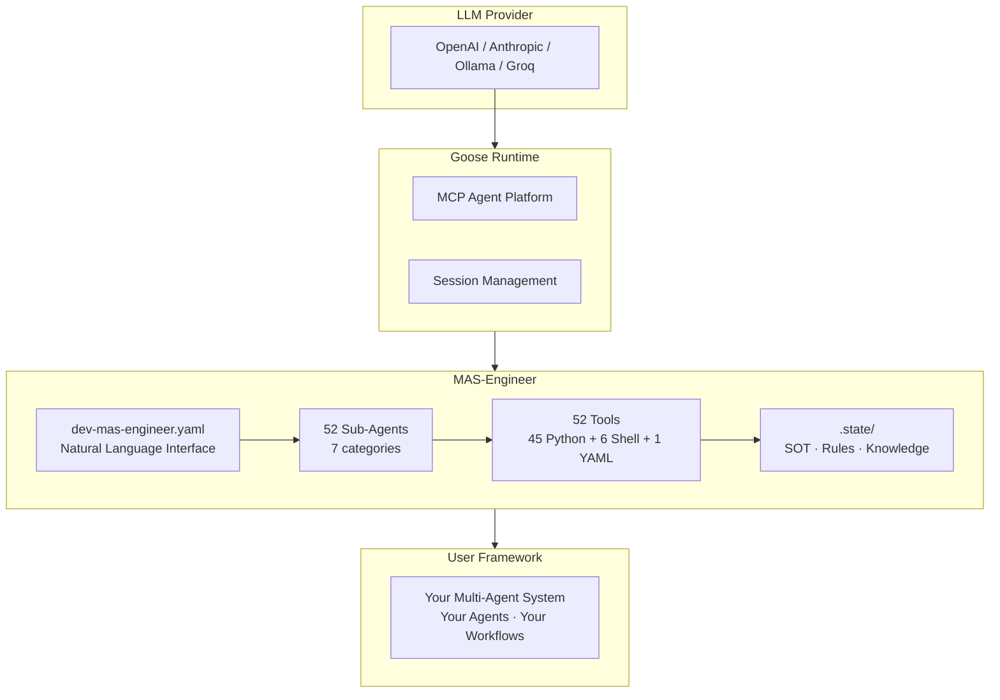
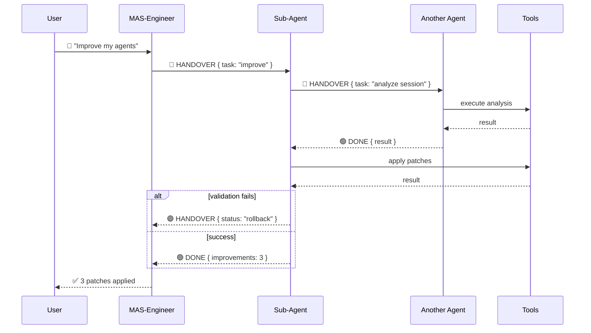
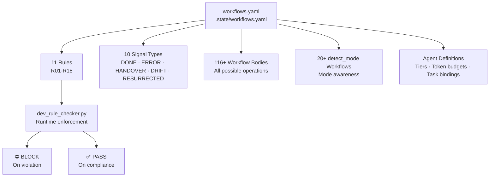
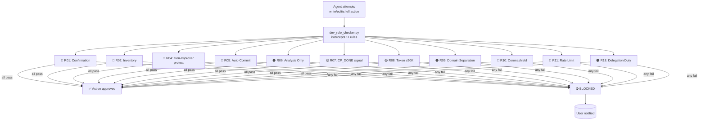
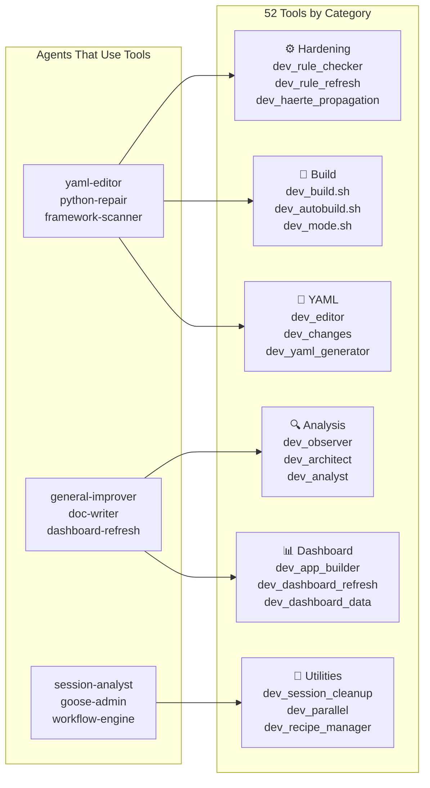

# Architecture

MAS-Engineer is a **hierarchical, rule-governed, self-improving multi-agent system** running inside Goose (Anthropic's MCP-based agent framework). It contains 52 specialized sub-agents, 52 tools (45 Python, 6 Shell, 1 YAML), and a workflow engine driven by a Single Source of Truth (SOT).



---

## Agent Hierarchy

```
MAS-Engineer (dev-mas-engineer)
│
├── FRAMEWORK BUILDERS (create & initialize)
│   ├── sub_mas-generic-init     — Lightweight project initialization
│   ├── sub_mas-bootstrap        — Full MAS-Engineer distribution deploy
│   ├── sub_mas-intention-parser — Natural language → agent YAML
│   ├── sub_mas-recipe-designer  — New sub-agent creation from template
│   ├── sub_mas-recipe-manager   — Recipe install/uninstall/cleanup
│   └── sub_mas-migration-helper — Framework version migration
│
├── IMPROVEMENT PIPELINE (self-optimization)
│   ├── sub_mas-general-improver — Orchestrator (7 steps)
│   ├── sub_mas-im-session-reader — Read session database
│   ├── sub_mas-im-finder        — Detect optimization potential (53 documented patterns)
│   ├── sub_mas-im-rank          — Prioritize & filter findings
│   ├── sub_mas-im-designer      — Convert findings to YAML patches
│   ├── sub_mas-im-validator     — Validate changes, compare scores
│   └── sub_mas-web-researcher   — Web research for current techniques
│
├── MONITORING (continuous health)
│   ├── sub_mas-mas-controller   — Schedule-driven cycle (every 5 min)
│   ├── sub_mas-monitor-health   — Framework integrity checks
│   ├── sub_mas-monitor-runtime  — Runtime status & crash recovery
│   ├── sub_mas-monitor-session  — Cycle & session logging
│   ├── sub_mas-monitor-recovery — Agent restart on death/timeout/loop
│   ├── sub_mas-agent-guardian   — Agent health, drift, death detection
│   └── sub_mas-health-reporter  — Daily health report generation
│
├── ANALYSIS (understanding & verification)
│   ├── sub_mas-framework-scanner        — Framework scanning/auditing
│   ├── sub_mas-framework-knowledge      — Dynamic structure discovery
│   ├── sub_mas-config-auditor           — 16 cross-reference checks
│   ├── sub_mas-prompt-engineer          — Prompt quality (10 criteria)
│   ├── sub_mas-goose-expert             — Goose rule compliance (14 scopes)
│   ├── sub_mas-session-analyst          — Session correlation & anomalies
│   └── sub_mas-test-runner              — pytest execution & regression
│
├── RECOVERY (5 stages, first-response)
│   ├── sub_mas-recovery-immune     — Coronashield: YAML/Python/Shell check
│   ├── sub_mas-recovery-checkpoint — Git-like snapshots
│   ├── sub_mas-recovery-safezone   — Fork workspace (isolated work)
│   ├── sub_mas-recovery-timeline   — Best checkpoint finder + restore
│   └── sub_mas-recovery-defib      — Emergency minimal-config revival
│
├── UTILITY TOOLS (operational)
│   ├── sub_mas-yaml-editor       — Safe YAML editing with backup/validate/rollback
│   ├── sub_mas-git-operator      — Git operations (no push without permission)
│   ├── sub_mas-python-repair     — Python code compile/fix/analyze
│   ├── sub_mas-doc-writer        — Markdown maintenance & link checking
│   ├── sub_mas-json-utility      — JSON validate/format/append
│   ├── sub_mas-worktree-manager  — Git worktree lifecycle management
│   ├── sub_mas-verification-runner — Post-commit test suite execution
│   ├── sub_mas-signal-generator  — CP_DONE/ERROR/SESSION_END signals
│   ├── sub_mas-summarizer        — Session report consolidation
│   └── sub_mas-interpreter       — User intent parsing
│
├── MANAGEMENT (administration)
│   ├── sub_mas-goose-admin       — Goose component management
│   ├── sub_mas-workflow-engine   — SOT workflow executor (11 action types)
│   ├── sub_mas-master-constitution — Central rules for all agents
│   ├── sub_mas-system-knowledge  — Auto-loaded system knowledge
│   ├── sub_mas-dashboard-refresh — On-demand dashboard generation
│   ├── sub_mas-doc-generator     — Documentation currency checker
│   └── sub_mas-degradation-handler — Degraded agent treatment
│
└── TEMPLATES
    └── agent_template.yaml       — Base template for new agents
```

---

## Communication Protocol

All agent-to-agent and agent-to-MAS-Engineer communication uses **structured YAML** with the following signal types:



| Signal | Meaning | Used When |
|--------|---------|-----------|
| `🟢 DONE` | Success | Task completed successfully |
| `🔴 ERROR` | Failure | Task failed unrecoverably |
| `🟣 HANDOVER` | Delegation | Task is passed to another agent |
| `⚠️ DRIFT` | Anomaly | Agent behavior deviation detected |
| `🔄 RESURRECTED` | Recovery | Agent restored from failure |

Each signal contains:
```yaml
signal: "🟣 HANDOVER"
request_id: string   # UUID for tracing
from: "agent-name"
to: "target-agent"
status: "success|warning|error"
parsed: { task: "...", result: {...} }
```

---

## The SOT (Single Source of Truth)

The `workflows.yaml` file in `.state/` is the central registry:



- **116+ workflow bodies** defining all possible operations
- **11 hard rules** (R01-R18) with hardness levels
- **10 signal types** for event handling
- **20+ detect_mode workflows** for mode awareness
- **Agent definitions** with tiers, token budgets, and task bindings

Every agent is defined in SOT. Every workflow references SOT. The `dev_rule_checker.py` enforces SOT rules at runtime.

---

## The Mode System

MAS-Engineer detects its operating mode from `.mas-mode` at startup (STEP 0 in mode-aware agents):

```yaml
# .mas-mode contains one of:
mas        → MAS mode: self-improvement (all rules active)
framework  → Framework mode: work on user's system
<project>  → Generic mode: new project initialization
```

**Mode-aware agents** (11+): `general-improver`, `agent-guardian`, `mas-controller`, `monitor-*`, `health-reporter`, `generic-init`, `im-finder`, `im-designer`

**Mode-agnostic agents**: Work the same in any mode, receiving `target_workspace` as parameter.

---

## Rules System (R01-R18)

All agents follow the **Constitution** (11 articles in `sub_mas-master-constitution.yaml`). **11 hard rules** are enforced by `dev_rule_checker.py` at runtime:



| Rule | Name | Hardness | Description |
|:----:|------|:--------:|-------------|
| R01 | Confirmation | 🔴 Blocking | Before write/edit/shell: PLAN+WAIT for user OK |
| R02 | Inventory | 🔴 Blocking | Check if tool/agent already exists |
| R04 | General-Improver | 🔴 Blocking | NEVER edit general-improver.yaml |
| R05 | Auto-Commit | 🔴 Blocking | After change: git+checkpoint+changes.json |
| R06 | Sub-Agent Analysis | 🟠 Strong | Sub-agent = only analyze, shell executes itself |
| R07 | CP_DONE Signal | 🟡 Normal | CP_DONE sent after each checkpoint (via signal-generator) |
| R08 | Token Budget | 🟡 Normal | General-Improver max 50K tokens; else ask user |
| R09 | Domain Separation | 🟠 Strong | ONLY work in target_workspace |
| R10 | Coronashield | 🔴 Blocking | Every YAML validated before storage |
| R11 | SI Rate Limit | 🔴 Blocking | Max 1 general-improver per 6h |
| R18 | Delegation Duty | 🟠 Strong | If sub-agent exists, MUST delegate |

---

## The 52 Tools

All Python and shell tools live in `tools/` and are managed by `dev_workspace.py`. Key categories:



| Category | Tools | Purpose |
|----------|-------|---------|
| **Hardening** | `dev_rule_checker.py` `dev_rule_refresh.sh` `dev_haerte_propagation.py` | Rule enforcement |
| **Build** | `dev_build.sh` `dev_autobuild.sh` `dev_mode.sh` | ZIP distribution, mode switching |
| **Analysis** | `dev_observer.py` `dev_architect.py` `dev_analyst.py` `dev_goose_db.py` | Framework analysis |
| **YAML** | `dev_editor.py` `dev_changes.py` `dev_yaml_generator.py` | YAML operations |
| **Dashboard** | `dev_app_builder.py` `dev_dashboard_refresh.py` `dev_dashboard_data.py` | MCP dashboard |
| **Utilities** | `dev_session_cleanup.sh` `dev_parallel.py` `dev_recipe_manager.py` `dev_goose_manager.py` | Operations |
