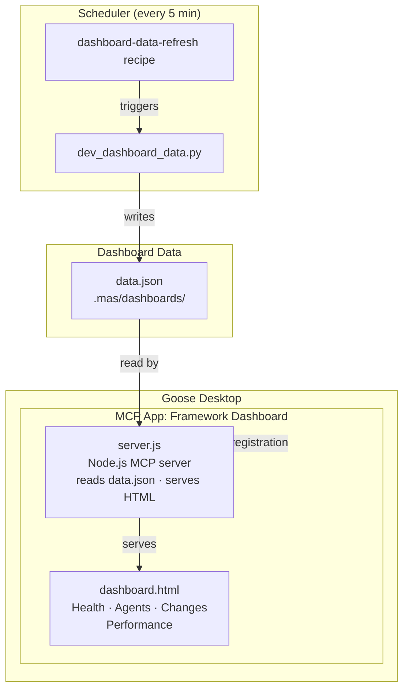
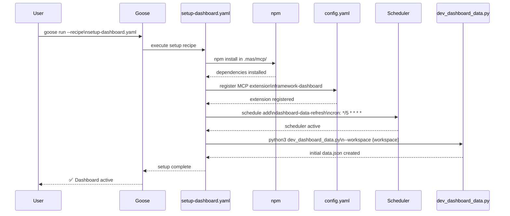

# Framework Dashboard

Every framework created or initialized by MAS-Engineer can have its own **MCP-based dashboard**. The dashboard is an MCP app that shows real-time health, performance, and status data.

---

## Architecture



---

## Setup

```bash
# Set up the dashboard for the CURRENT framework
goose run --recipe recipe/setup-dashboard.yaml
```



The setup recipe:

1. **npm install** in `.mas/mcp/` (installs server.js dependencies)
2. **Registers a Goose extension** in `~/.config/goose/config.yaml`:
   ```yaml
   extensions:
     framework-dashboard:
       type: stdio
       name: framework-dashboard
       enabled: true
       cmd: node
       args: ["{workspace}/.mas/mcp/server.js"]
       description: "Framework Dashboard MCP App"
       timeout: 300
   ```
3. **Sets up a scheduler** (every 5 minutes):
   ```bash
   goose schedule add --schedule-id dashboard-data-refresh \
     --cron "0 */5 * * * *" \
     --recipe-source {workspace}/recipe/dashboard-data-refresh.yaml
   ```
4. **Generates initial data** via:
   ```bash
   python3 tools/dev_dashboard_data.py --workspace {workspace}
   ```

---

## Data Collected

Every 5 minutes, the scheduler runs `dev_dashboard_data.py` which collects:

| Category | Data | Source |
|----------|------|--------|
| **Agents** | Total, healthy, degraded, dead | `recipe/sub/*.yaml` |
| **Changes** | Total, today's, last change | `.state/changes.json` |
| **Sessions** | Total, today's, stale | `goose sessions DB` |
| **Health** | YAML validity, rule compliance | `dev_rule_checker.py`, `dev_analyst.py` |
| **Build** | ZIP size, last build date | `dev_build.sh --status` |
| **Performance** | Token usage, costs, durations | Session DB |

---

## Dashboard Components

```mermaid
flowchart LR
    subgraph HEALTH["🩺 Health Panel"]
        H1["Score: 0-100"]
        H2["Agents: 🟢🟡🔴"]
        H3["Failures: count"]
        H4["Staleness: indicator"]
    end
    subgraph AGENTS["🤖 Agents Panel"]
        A1["🟢 healthy"]
        A2["🟡 degraded"]
        A3["🔴 dead"]
        A4["Quick details"]
    end
    subgraph CHANGES["📝 Changes Panel"]
        C1["Recent changes"]
        C2["Before/after diff"]
        C3["Rollback option"]
    end
    subgraph PERF["📈 Performance Panel"]
        P1["Token trends"]
        P2["Session costs"]
        P3["Anomaly warnings"]
    end

    HEALTH --> AGENTS --> CHANGES --> PERF
```



### Health Panel
- Overall score (0-100)
- Agent count by status
- Recent failures count
- Data staleness indicator

### Agents Panel
- List of all agents with health status
- Color-coded: 🟢 healthy, 🟡 degraded, 🔴 dead
- Quick access to individual agent details

### Changes Panel
- Recent changes from `changes.json`
- Before/after comparison
- Rollback options

### Performance Panel
- Token consumption trends
- Session costs over time
- Warning on anomalies

---

## Manual Refresh

```bash
python3 tools/dev_dashboard_data.py --workspace {workspace}
```

---

## Dashboard Location

Each framework's dashboard files are stored within the framework project:

```
{workspace}/
└── .mas/
    ├── mcp/
    │   ├── server.js        # MCP server (Node.js)
    │   ├── dashboard.html   # Frontend
    │   └── package.json     # Dependencies
    └── dashboards/
        └── data.json        # Dashboard data
```

---

## Troubleshooting

| Problem | Solution |
|---------|----------|
| Dashboard not showing | Restart Goose (new extension registration) |
| No data | Run `python3 tools/dev_dashboard_data.py` manually |
| npm install failed | Install Node.js 18+, then run npm install manually |
| Scheduler not running | `goose schedule list` → check dashboard-data-refresh |
| Data stale | Wait up to 5 min for next scheduler run, or refresh manually |
