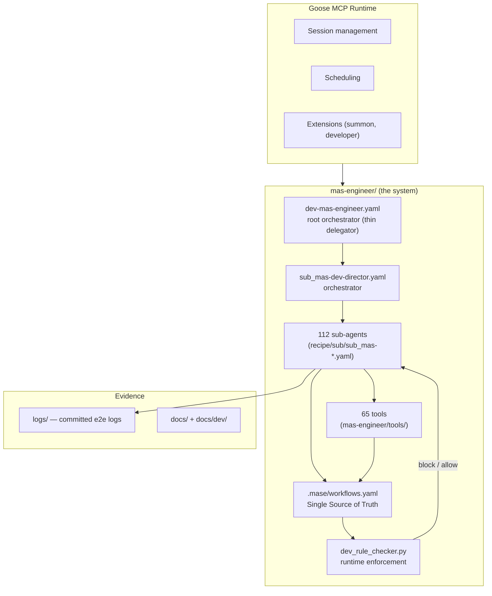
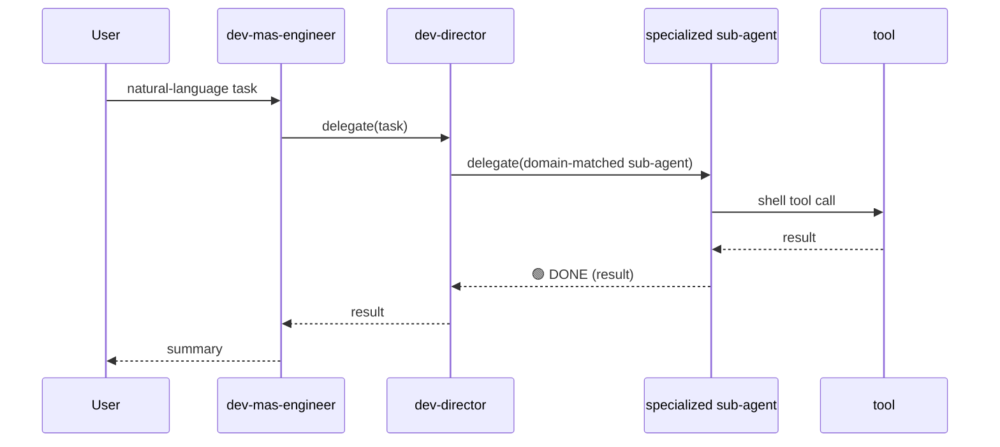
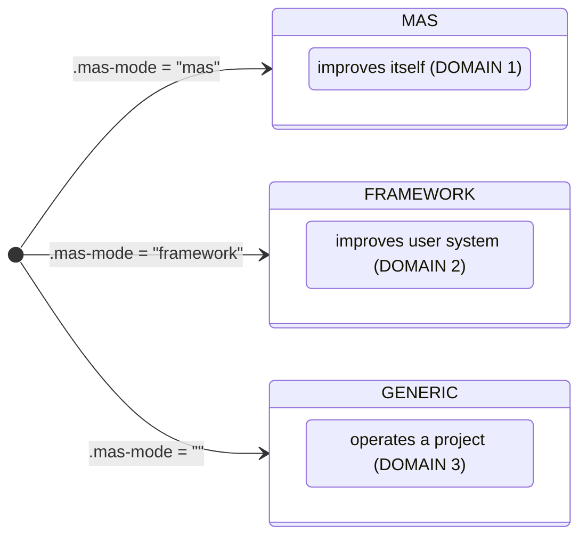

# System Architecture

This document describes the internal architecture of MAS-Engineer at the level a
developer needs to extend or debug it. It covers the layered model, the delegation
flow, the mode system, and the data model.

## Layered model



The system is deliberately **thin at the top**: `dev-mas-engineer.yaml` only
delegates to `sub_mas-dev-director.yaml`, which routes tasks to specialized
sub-agents based on the task domain. Almost all behavior lives in the sub-agents
and tools.

## Root orchestrator flow



`dev-director` uses a **delegation map** to route domains:

| Domain | Sub-agent |
|--------|-----------|
| analyze / audit / scan | `sub_mas-dev-analyzer` |
| design / create / generate | `sub_mas-dev-builder` |
| test / validate / verify | `sub_mas-dev-tester` |
| research / monitor | `sub_mas-dev-observer` |
| commit / git / push | `sub_mas-git-operator` |
| degradation | `sub_mas-degradation-director` |
| team packaging | `sub_mas-team-packager-director` |
| test reporting | `sub_mas-test-reporter-director` |

## Mode system (R14, R110-31)

The operating mode is read from `.mas-mode` and determines which **domain** a
sub-agent belongs to:



Detection priority (R110-31): `.mas-mode` value > action-string heuristic.

- **mas** (DOMAIN 1): all `sub_mas-*.yaml` must be registered in
  `configs.mas-self.sub_agents`.
- **framework** (DOMAIN 2): a mas-generated team; the orchestrator's
  instructions are the registry.
- **generic** (DOMAIN 3): a standalone project; mas-engineer's `workflows.yaml`
  is not involved.

## Data model

MAS-Engineer's state is concentrated in `.mase/`:

```
.mase/
├── workflows.yaml          # SOT — agents, rules, workflows, signals, paths
├── knowledge/              # 9 knowledge files (architecture, rules, tools, ...)
├── rules/                  # rule definitions + hardness levels
├── templates/              # agent schemas, guidelines, BP checklist
├── skills/                 # 20 SKILL.md files (agent runtime skills)
├── mcp/                    # MCP dashboard server (Node.js)
├── config/                 # cost.yaml (budget gates)
├── directives/             # R-sprint directive specs
├── pipeline/               # IM-pipeline outputs (findings, patches, validation)
└── checkpoints/            # recovery checkpoints
```

Evidence (test logs, e2e results, reports) lives outside `.mase/` in `logs/` at
the repository root and is committed to GitHub.

## Repository layout

```
repo root/
├── mas-engineer/           # the system (recipes, tools, tests, .mase)
├── logs/                   # committed e2e evidence
├── docs/                   # documentation (guides)
│   └── dev/                # developer documentation (this)
├── archive/                # historic reports, samples, legacy scripts
├── demos/                  # demo teams
├── install.sh              # installer
└── README.md
```

## See also

- [sot.md](sot.md) — the SOT schema and path resolution
- [communication.md](communication.md) — agent protocol
- [rules.md](rules.md) — runtime rule enforcement
