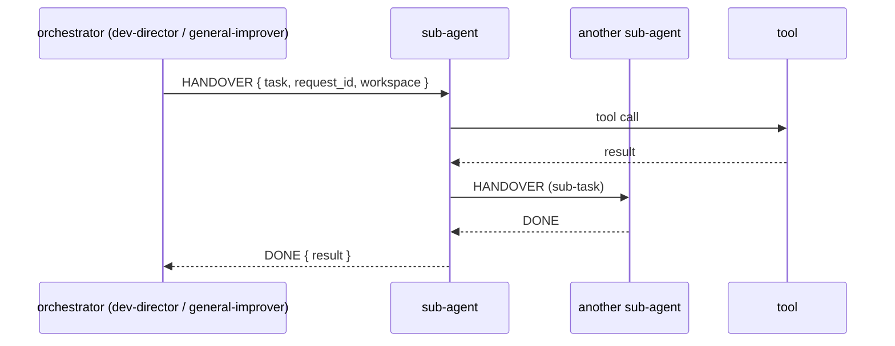

# Agent Communication Protocol

All agent-to-agent and agent-to-orchestrator communication uses **structured
YAML** with typed signals. This is defined by the constitution (Article 4–5) and
enforced by the signal schema in the SOT.

## Signal types

| Signal | Meaning | Used when |
|--------|---------|-----------|
| `🟢 DONE` | success | task completed |
| `🟡 PARTIAL` | partial success | some work done, blockers remain |
| `🔴 ERROR` | failure | unrecoverable error |
| `🟣 HANDOVER` | delegation | task passed to another agent |
| `⚠️ DRIFT` | anomaly | behavior deviation detected |
| `🔄 RESURRECTED` | recovery | agent restored from failure |

## Delegation flow



## Signal schema

```yaml
specialist_result:          # success
  signal: "🟢 DONE"
  request_id: string
  from: "{agent_id}"
  to: "executor"
  task_id: string
  status: "completed|partial|blocked"
  summary:
    steps: []
    changes: []
    findings: []
    quality:
      coverage: number
      tests_passed: number
    blockers: []
```

```yaml
specialist_error:           # failure
  signal: "🔴 ERROR"
  request_id: string
  from: "{agent_id}"
  to: "executor"
  task_id: string
  status: "error"
  error: string
```

```yaml
specialist_handover:        # delegation
  signal: "🟡 HANDOVER"
  request_id: string
  from: "{agent_id}"
  to: "executor"
  reason: string
  context: string
```

## Signal discipline (Article 5)

- Messages are machine-readable YAML in the given schema.
- No natural-language text outside the YAML blocks.
- Each signal carries `request_id`, `from`, `to`.
- Successful completion uses `specialist_result`; blockers use
  `specialist_error`; handovers use `specialist_handover`.

## Sub-agent tool model

Sub-agent recipes are loaded with limited tools:

```yaml
extensions:
  - type: platform
    name: summon        # delegate + load (read-only)
  - type: builtin
    name: developer     # shell/read_file/write_file/edit/tree (for writing agents)
```

- `summon` enables delegation and loading.
- `developer` enables real file writes. Without it, sub-agents can only propose.
- Sub-agents inherit parent extensions; `summon` must be listed explicitly when a
  sub-agent itself spawns sub-agents.

## See also

- [architecture.md](architecture.md) — the delegation map
- [rules.md](rules.md) — R01/R18 govern communication behavior
