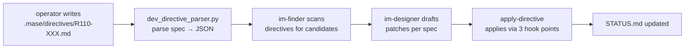

# Directive Workflow

R-sprint directives are operator-written specifications that drive the
improvement pipeline. They live in `.mase/directives/` as `R<NNN>-<topic>.md`
files and are consumed by the IM pipeline's FIND → RANK → DESIGN → VALIDATE →
APPLY flow.

## Directive lifecycle



## Processing steps

1. **Write**: an operator places an intent-spec in `.mase/directives/`. It is a
   **contract** (implementation requirements), not a finished patch.
2. **Parse**: `dev_directive_parser.py` converts the markdown spec into a JSON
   intent (scope, rules, expected changes).
3. **Scan**: `sub_mas-im-finder` includes `.mase/directives/*.md` in its FIND
   phase; spec-drift detectors (`dev_spec_invariant.py`) verify recipes still
   match the documented contracts.
4. **Design**: `sub_mas-im-designer` drafts patches per the spec.
5. **Apply**: `sub_mas-apply-directive` applies approved changes via the
   directive's hook points and records state in
   `.mase/directive_already_applied.json` and `.mase/changes.json`.
6. **Track**: `.mase/directives/STATUS.md` records each directive's PHASE.

## Spec-drift protection

`dev_spec_invariant.py` and `dev_self_audit.py` guard against **spec drift** —
the recipe no longer matching what the directive/README documents. Pattern A
detects hardcoded numbers without env-var context; Pattern B detects stale
literals that disagree with actual files/tools.

## Apply hooks

`sub_mas-apply-directive` applies a directive at three hook points:

1. **Pre-check**: verify prerequisites (files exist, invariants hold).
2. **Change**: apply the spec's edits (recipes, tools, tests).
3. **Post-check**: verify the result (YAML valid, tests pass, no drift).

## Example directives

```
.mase/directives/
├── README.md
├── STATUS.md                       # per-directive phase tracker
├── R110-106-designer-im-top-n-respect.md
├── R110-107-im-designer-top-n-fix.md
├── R110-108-sd-detector-integration.md
├── R110-109-self-audit-spec-invariant.md
└── ... (21 total)
```

## Relationship to the pipeline

Directives are the **operator-in-the-loop** mechanism that complements the
pipeline's autonomous FIND/RANK. They let a human steer what the pipeline should
improve, and the pipeline verifies the result against the spec (spec-drift
checks).

See also: [improvement-pipeline.md](improvement-pipeline.md) — the pipeline that
executes directives; [rules.md](rules.md) — R04 protects the improver itself.
