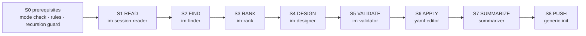
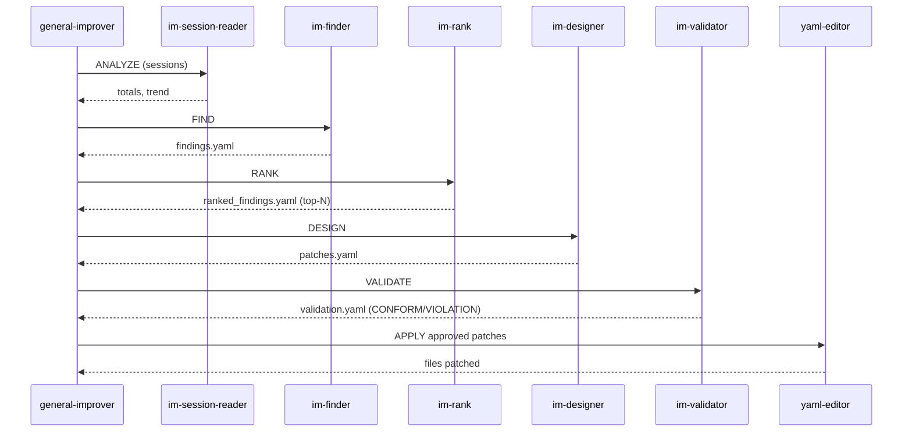

# Self-Improvement Pipeline (8 stages)

MAS-Engineer improves itself. The improvement (IM) pipeline is the only entry
point into the self-improvement system. It is orchestrated by
`sub_mas-general-improver` and executed by five `im-*` sub-agents.

## Stage overview



| Stage | Sub-agent | Reads | Writes |
|-------|-----------|-------|--------|
| S0 | — (orchestrator) | `.mas-mode`, `.state/schedule.yaml` | — |
| S1 | `im-session-reader` | goose session DB | session summary |
| S2 | `im-finder` | session summary | `.mase/pipeline/findings.yaml` |
| S3 | `im-rank` | findings | `.mase/pipeline/ranked_findings.yaml` |
| S4 | `im-designer` | ranked findings | `.mase/pipeline/patches.yaml` |
| S5 | `im-validator` | patches | `.mase/pipeline/validation.yaml` |
| S6 | `yaml-editor` | approved patches | applies to recipe/tool files |
| S7 | `summarizer` | results | `.mase/changes.json`, summary |
| S8 | `generic-init` | summary | PUSH_IMPROVEMENTS |

## End-to-end sequence



## Artifacts

All pipeline state lives under `.mase/pipeline/`:

```
.mase/pipeline/
├── findings.yaml            # S2 output
├── ranked_findings.yaml     # S3 output (top-N, severity ceiling)
├── patches.yaml             # S4 output (file/field/from/to/reason)
├── validation.yaml          # S5 output (CONFORM / VIOLATION verdicts)
├── signals.log              # signal journal
└── round*_findings.json     # per-round findings (archived)
```

## Guards

- **Recursion guard**: full improvement runs at most once per 24 h
  (`R11` rate limit), unless `RECURSION_OVERRIDE` is set.
- **Cost limit**: ≤ 5 self-improve entries per day in `.mase/changes.json`.
- **Recycle**: if all patches get `verdict=RESTRICTED` from goose-expert, the
  validator marks `status: skipped_charge` and the orchestrator re-runs with a
  lower severity ceiling (max 3 recycles/day).
- **Self-audit (S6.5)**: if the pipeline touches evidence/cert docs, the
  self-auditor re-checks that claims are backed by real logs ("verification
  theater" guard).

## Goose-expert cross-cutting consultation

`sub_mas-goose-expert` is consulted (via the `summon` extension) at pipeline
start and at the end, to verify planned and cumulative changes are
Goose-architecture-compliant. Failure to summon invalidates the run.

## Task types

The pipeline supports: `FULL_IMPROVEMENT`, `REVIEW`, `COST_ANALYSIS`,
`ERROR_PATTERN`, `CORRECTION_LOG`, `USAGE_PATTERN`, `APPLY_ONLY`,
`SPLIT_AGENT` (triggered by intention-parser after multi-role agent creation).

See also: [directives.md](directives.md) — how operator-written specs enter the
pipeline, and [recovery.md](recovery.md) — what happens if an apply fails.
