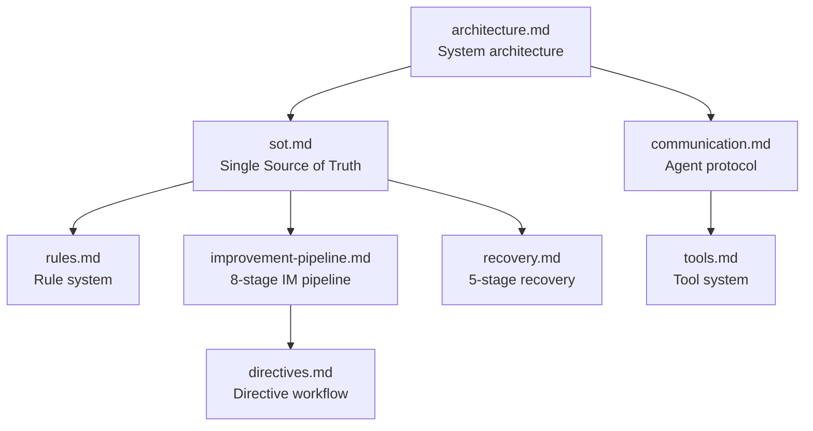

# Developer Documentation

Detailed, implementation-level documentation of MAS-Engineer's core
functionality. These documents describe **how** the system works, for developers
who need to extend, debug, or study the codebase.

## Documents

| Document | Contents |
|----------|----------|
| [architecture.md](architecture.md) | Layered system architecture, delegation flow, mode system, data model. |
| [sot.md](sot.md) | The Single Source of Truth (`workflows.yaml`): schema, sections, path resolution, agent registry. |
| [rules.md](rules.md) | The rule system (R01–R18): hardness levels, runtime enforcement, `dev_rule_checker.py`. |
| [improvement-pipeline.md](improvement-pipeline.md) | The 8-stage self-improvement pipeline end-to-end. |
| [recovery.md](recovery.md) | The 5-stage Phoenix recovery system. |
| [communication.md](communication.md) | Agent-to-agent communication protocol and signal schema. |
| [tools.md](tools.md) | The tool system: categories, lookup, invocation. |
| [directives.md](directives.md) | How R-sprint directive specs are processed by the improvement pipeline. |
