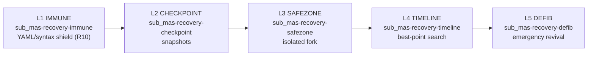
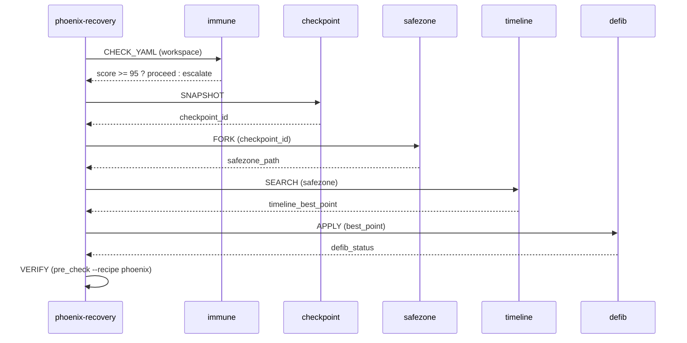

# Phoenix Recovery (5 stages)

MAS-Engineer protects its workspace against corruption, broken YAML, failed
commits, and partial failures through a 5-stage recovery system, orchestrated by
`sub_mas-phoenix-recovery`.

## Stage overview



| Stage | Agent | Task | Output |
|-------|-------|------|--------|
| L1 | `recovery-immune` | validate all YAML (R10 coronashield) | score 0-100 |
| L2 | `recovery-checkpoint` | snapshot current state | checkpoint_id, backup_path |
| L3 | `recovery-safezone` | fork workspace to `.mase/safezones/` | safezone_path |
| L4 | `recovery-timeline` | find best historical point | timeline_best_point |
| L5 | `recovery-defib` | apply best point, restart cycle | defib_status |

## Level ordering rule (HARD)

L1 must run before L2, L2 before L3, etc. Skipping levels is prohibited unless
`start_level` is explicitly set. Rationale: L1 validates the YAML that L2
snapshots; L2 produces the snapshots L3 forks; L3 forks the safezone L4
searches; L4 produces the result L5 applies.

## Full recovery sequence



## Trigger conditions

`phoenix-recovery` is invoked when any of:

- `pre_check --recipe phoenix` reports FAIL
- 2+ recovery sub-agents have failed in succession
- a commit broke the working tree (post-push gate fails)
- the user explicitly asks to "recover" / "phoenix"
- the dispatch graph has lost > 10% of its nodes

## Edge cases

- **Empty workspace**: P3 info, no recovery needed.
- **Permission denied**: P1 error, escalate to user.
- **Sub-agent timeout**: escalate with partial results.
- **Concurrent invocations**: only 1 active session per workspace (lock file).
- **Loop detection**: same level failing 3× → stop, escalate.

## Recovery templates

Recovery sub-recipes are also generated into new projects from
`recipe/template/recovery/`:

```
recipe/template/recovery/
├── immune.yaml
├── checkpoint.yaml
├── safezone.yaml
├── timeline.yaml
└── defib.yaml
```

## Workflows in the SOT

Each recovery level has a task workflow in the SOT (`task_workflows`), all with
an `auto_repair` step that references real `restore` logic (validated by
`pre_check --recipe auto_repair`).

See also: [improvement-pipeline.md](improvement-pipeline.md) — recovery also
guards IM applies; [sot.md](sot.md) — recovery workflows live in the SOT.
