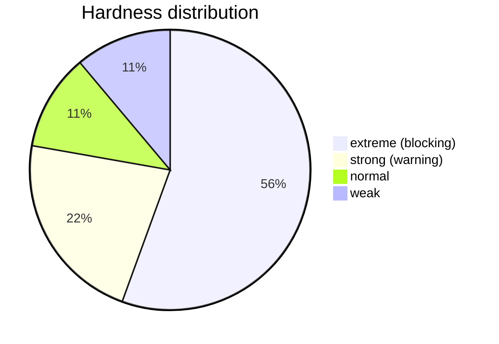
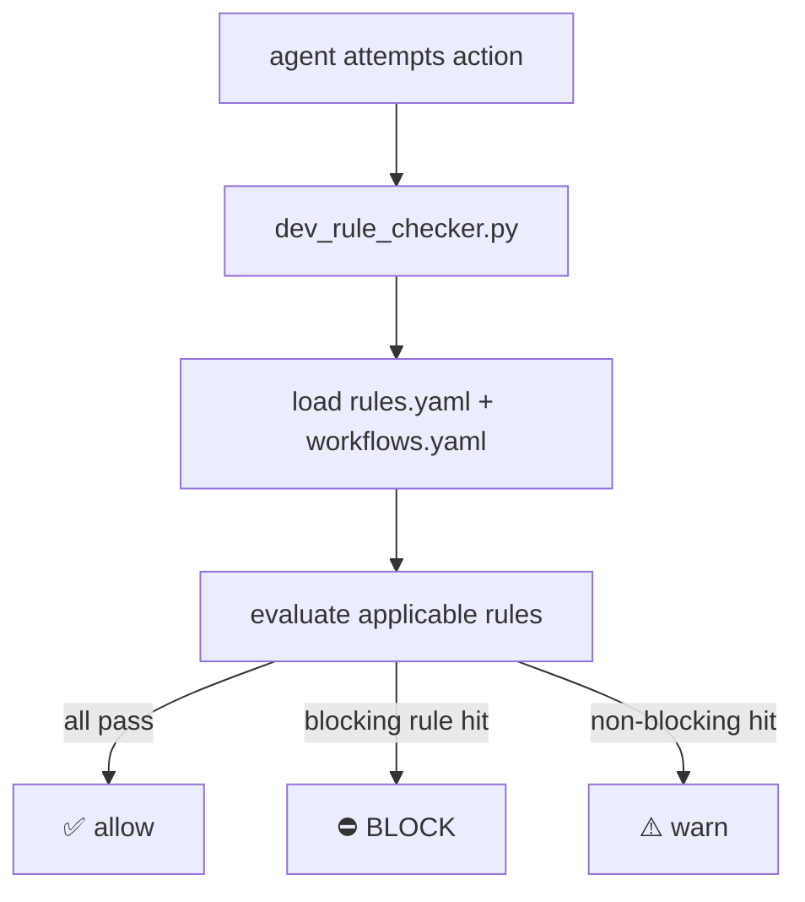

# Rule System (R01–R18)

MAS-Engineer enforces governance at runtime, not merely documents it. Rules are
defined in `.mase/rules/rules.yaml` and the SOT, and enforced by
`dev_rule_checker.py` before every write/edit/shell action.

## Hardness levels

Each rule has a **hardness level** that controls its token reserve and whether a
violation blocks or warns:

| Level | Symbol | Blocks? | Token reserve |
|-------|--------|---------|---------------|
| extreme (5) | ⛔⛔⛔⛔⛔ | yes | 800 |
| strong (4) | ⛔⛔⛔ | warning | 500 |
| normal (2) | ⛔ | no | 300 |
| weak (1) | ⚠️ | no | 100 |



## Active rules

| Rule | Name | Hardness | Behavior |
|:----:|------|:--------:|----------|
| R01 | Confirmation | extreme | before write/edit/shell: plan + wait for user OK |
| R02 | Inventory | extreme | check if tool/agent already exists |
| R04 | General-Improver protect | extreme | never edit `general-improver.yaml` |
| R05 | Auto-Commit | extreme | after change: git + checkpoint + changes.json |
| R06 | Sub-agent containment | strong | sub-agent = analysis only |
| R07 | CP_DONE signal | normal | signal after checkpoint |
| R08 | Token budget | normal | improver ≤ 50K tokens |
| R09 | Domain separation | extreme | only target workspace |
| R10 | Coronashield | extreme | validate YAML before storage |
| R11 | SI rate limit | extreme | max 1 improver per 6h |
| R18 | Delegation duty | strong | if sub-agent exists, delegate |
| R55 | IM_TOP_N | extreme | code-enforced top-N at im-rank |

## Enforcement flow



The checker reads the rules from:

```
.mase/rules/rules_5_extreme.yaml
.mase/rules/rules_4_strong.yaml
.mase/rules/rules.yaml
.mase/rules/hard_rules.yaml
.mase/workflows.yaml   (restrictions + enforcement)
```

## Rule refresh

Rules can be refreshed from templates via `dev_rule_refresh.sh`, which regenerates
the level-split files (`rules_2_normal.yaml`, `rules_4_strong.yaml`,
`rules_5_extreme.yaml`) from the canonical `rules.yaml`.

## Domain coupling (R09, R14)

The mode (`.mas-mode`) determines the domain. Writes outside the target workspace
are blocked. Reads across domains are allowed. This is enforced by R09 and
encoded in `configs.mas-self.restrictions`.

See also: [sot.md](sot.md) for the restriction schema, and
[architecture.md](architecture.md) for the mode system.
