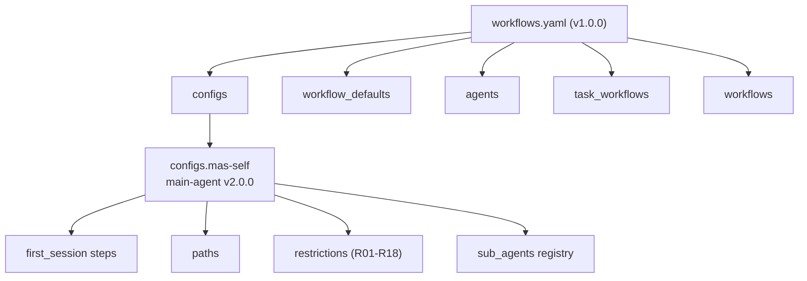
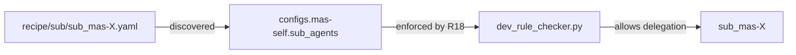
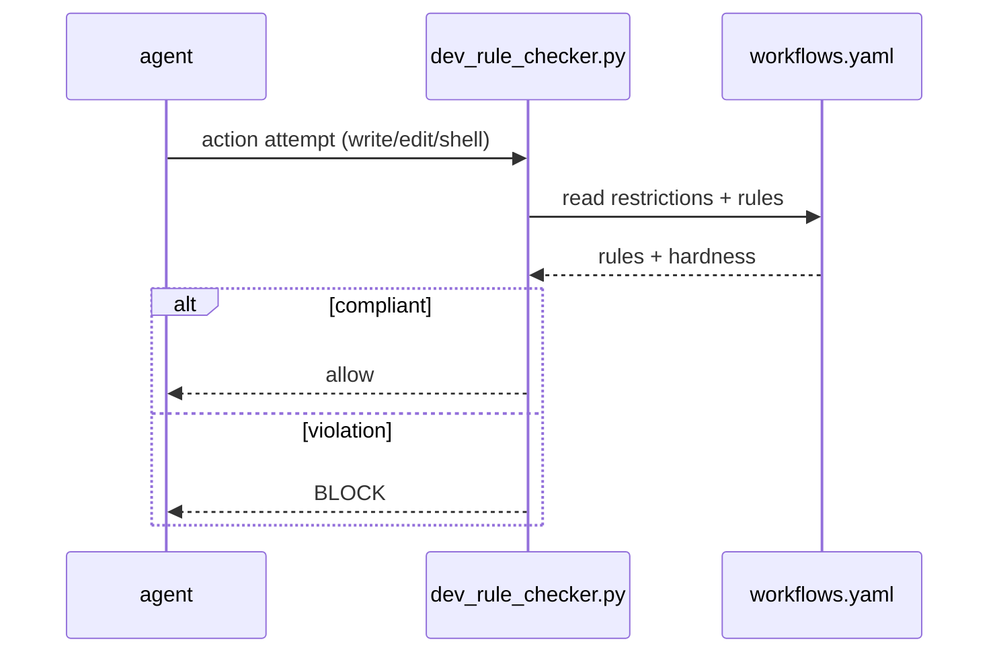

# Single Source of Truth (SOT)

The file `.mase/workflows.yaml` is the **single source of truth** for the entire
system. Every agent, rule, workflow, signal, and path is defined here, and the
runtime rule checker (`dev_rule_checker.py`) enforces it.

## Top-level structure



| Section | Purpose |
|---------|---------|
| `configs.mas-self` | main-agent config: first-session steps, paths, mode, restrictions, sub_agents registry |
| `workflow_defaults` | default timeout / on_error / retry / tier for workflows |
| `agents` | per-agent definitions: tiers, token budgets, task bindings |
| `task_workflows` | the operational workflows (122+, incl. 5 recovery) |
| `workflows` | named workflow bodies |

## Path resolution

The `configs.mas-self.paths` section defines where everything lives:

```yaml
paths:
  mas:
    source_dir: '{workspace}/mas-engineer'      # the system
    install_dir: ~/.config/goose/recipe         # goose runtime
    tools_install: ~/.config/goose/recipe/mas-engineer-tools
    state_dir: '{workspace}/mas-engineer/.mase' # SOT + state
  projekt:
    work_dir: '{workspace} (dynamic)'
  mode:
    current: mas
    current_via: cat {workspace}/mas-engineer/.mas-mode || cat ~/.config/goose/.mas-mode
```

`{workspace}` is resolved by the caller. The `.goosehints` file mirrors these
constants for the Goose runtime:

```
MAS_SOURCE_DIR={workspace}/mas-engineer
MAS_STATE_DIR={workspace}/mas-engineer/.mase
MAS_TOOLS_DIR=~/.config/goose/recipes/mas-engineer-tools
MAS_INSTALL_DIR=~/.config/goose/recipes
MAS_WORKSPACE={workspace}
```

## Agent registration

For `work_on=mas` (DOMAIN 1), every sub-agent must be registered under
`configs.mas-self.sub_agents`. Registration is enforced by R18 and R110-31.
The recipe file (`recipe/sub/sub_mas-*.yaml`) holds the actual agent definition;
the SOT entry references it.



## Schema validation

The schema for agents and configs is documented in `.mase/sot_schema.yaml`:

- **agent_schema.required**: `name`, `type`, `task`
- **restrictions**: `allowed_paths`, `forbidden_paths`, `max_steps`, `timeout`,
  `requires_confirmation`, `requires_coronashield`, `allowed_actions`,
  `allowed_tools`, `allowed_delegates`
- **workflow.steps**: `id`, `action` (`shell | delegate | write | edit | signal |
  rule_check | sub_workflow`), `cmd`, `agent`, `task`, `target`

## Enforcement



See [rules.md](rules.md) for the enforcement details.
