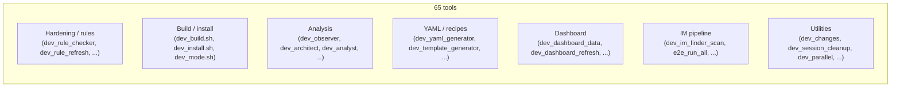
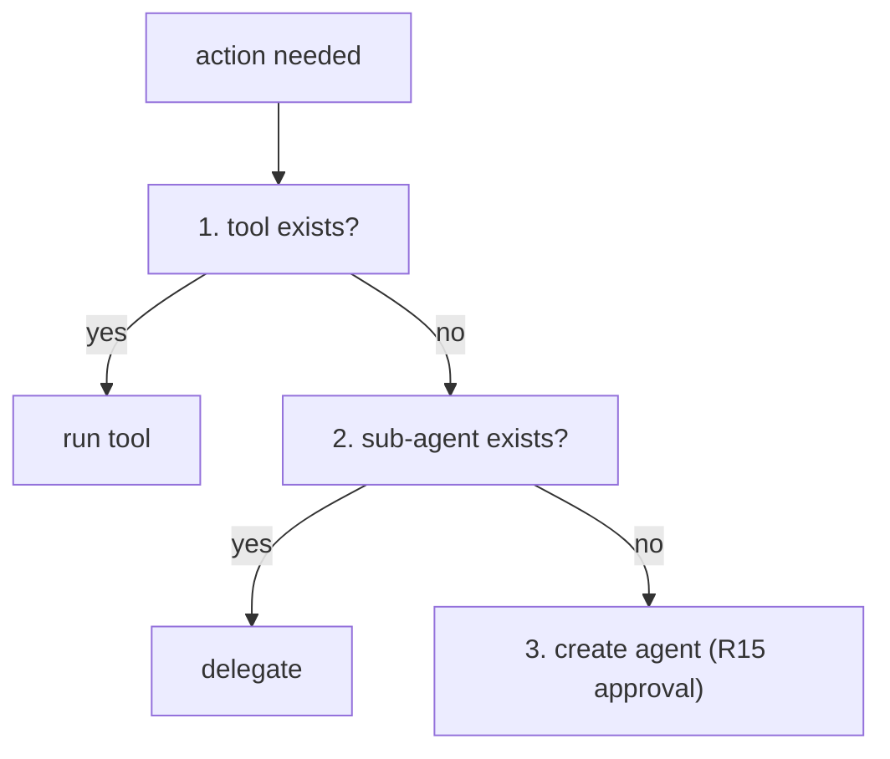

# Tool System

MAS-Engineer ships 65 tools (58 Python, 6 Shell, 1 YAML) in `mas-engineer/tools/`.
Tools are the executable layer that sub-agents call via the shell. They are
managed by `dev_workspace.py` and installed by `dev_install.sh` /
`skills-install.sh`.

## Tool categories

| Category | Representative tools | Purpose |
|----------|---------------------|---------|
| Hardening / rules | `dev_rule_checker.py`, `dev_rule_refresh.sh`, `dev_haerte_propagation.py` | runtime rule enforcement |
| Build / install | `dev_build.sh`, `dev_install.sh`, `dev_mode.sh` | distribution, install, mode switch |
| Analysis | `dev_observer.py`, `dev_architect.py`, `dev_analyst.py`, `dev_goose_db.py` | framework analysis |
| YAML / recipes | `dev_yaml_generator.py`, `dev_template_generator.py`, `dev_yaml_immune.py` | YAML ops, agent generation |
| Dashboard | `dev_dashboard_data.py`, `dev_dashboard_refresh.py` | MCP dashboard data |
| IM pipeline | `dev_im_finder_scan.py`, `e2e_run_all.py`, `pre_check` | improvement + verification |
| Utilities | `dev_changes.py`, `dev_session_cleanup.sh`, `dev_parallel.py`, `dev_recipe_manager.py` | operations |

## Tool lookup order (R16)

Before executing any action, the system resolves in this order:

This is R16 (tool → expert → new agent), sharpened by R18 (delegation duty).

## Install paths

- **Source tools**: `mas-engineer/tools/` — for development/building only.
- **Installed tools**: `~/.config/goose/recipes/mas-engineer-tools/` — the ONLY
  path used for execution (R19 path hierarchy).
- The `.goosehints` file exposes `MAS_TOOLS_DIR` for the runtime.

## Key tools in detail

### `dev_rule_checker.py`

Reads rules from `.mase/rules/` and `.mase/workflows.yaml`, evaluates the
applicable rules for an action, and returns 0 (allow) or non-zero (block). Used
by every sub-agent before write/edit/shell.

### `dev_template_generator.py`

Creates new agent recipes from `recipe/template/agent_template.yaml` + the SOT.
Registers the agent in `workflows.yaml` and `dev-mas-engineer.yaml`.

### `dev_dashboard_data.py`

Parses sub-agents from `recipe/sub/`, reads self-reported health, and writes
`.mase/dashboards/data.json` for the MCP dashboard.

### `e2e_run_all.py`

Runs the end-to-end workflow suite (recipe YAML parse, top workflows, recovery
workflows, task workflow sample) and writes results to `logs/e2e-results/`.

### `pre_check`

Deterministic pre-checks for e2e recipes (auto-repair, german, phoenix) that save
LLM tool-calls by validating invariants directly.

## Tool invocation

Tools are invoked by sub-agents via `shell` actions. The shell command must use
the installed path (`python3 {MAS_TOOLS_DIR}/dev_foo.py`), never the source path,
per R19. Reading source tools for development is allowed.

See also: [rules.md](rules.md) — R16/R18/R19 govern tool use.
