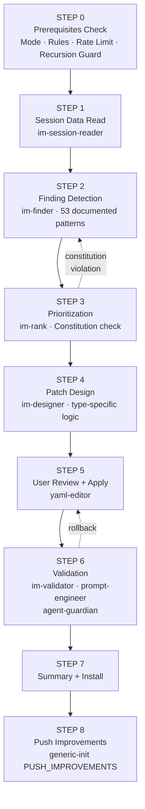
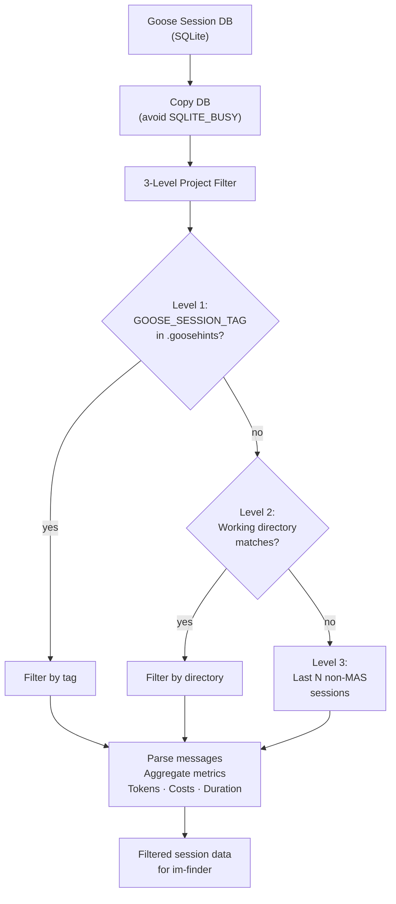
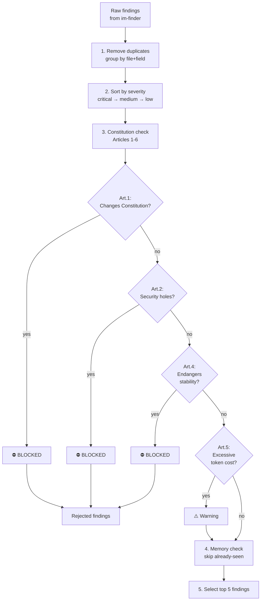
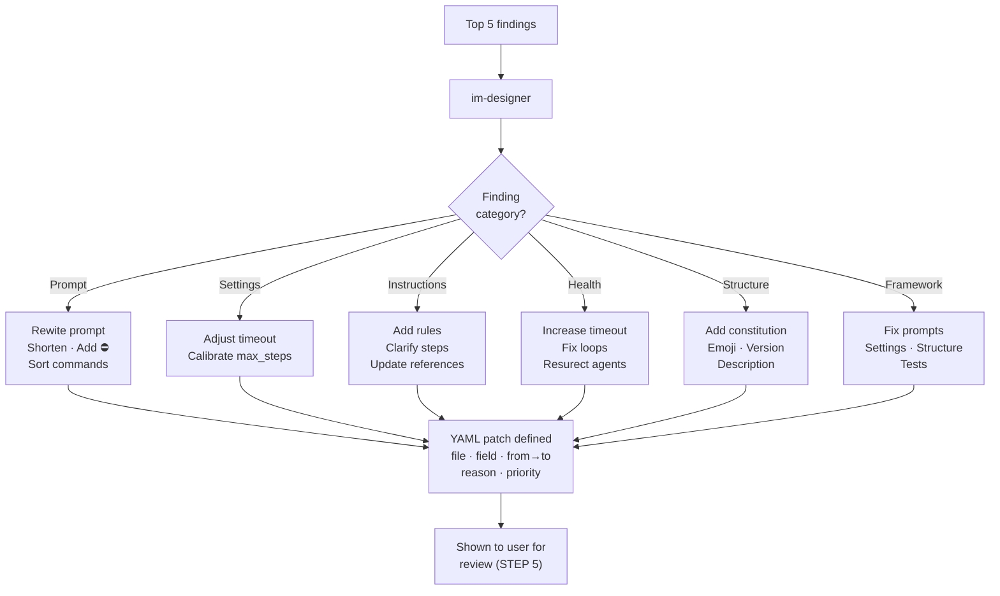
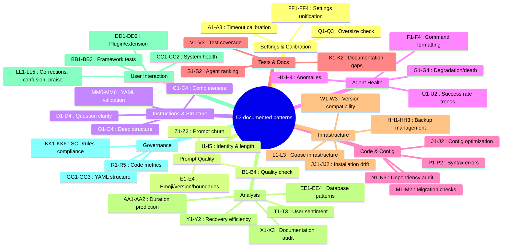

# Improvement Pipeline

MAS-Engineer's self-improvement system is an **8-stage pipeline (S1-S8, with S0 Prerequisites)** orchestrated by `sub_mas-general-improver`. It analyzes the system's own sessions, detects optimization potential, designs patches, applies them, and validates the result.

---

## Pipeline Overview



---

## Stage Details

### STEP 0 — Prerequisites Check

Before the pipeline starts:
- Mode detection (MAS/Framework/Generic)
- Rule hardening check via `dev_rule_checker.py`
- Timing check via `schedule.yaml` (max 1 run per 6h — R11)
- Rate limit: max 5 changes per session
- Recursion guard: only 1 round, no recursion (R04)

### STEP 1 — Session Data Read

`sub_mas-im-session-reader` reads the Goose session database (SQLite):



1. Copies the DB (to avoid SQLITE_BUSY)
2. Applies a **3-level project filter**:
   - Level 1: `GOOSE_SESSION_TAG` from `.goosehints` (recommended)
   - Level 2: working directory match
   - Level 3: fallback to last N non-MAS sessions
3. For each session: parses messages, aggregates metrics (tokens, costs)
4. Optionally extracts chat messages for pattern analysis

### STEP 2 — Finding Detection

`sub_mas-im-finder` applies **53 documented patterns** (A-KK + LL + MM) to detect:

- **Type A**: Timeout/max_steps too high or too low
- **Type B**: Prompt too vague, too long, missing context
- **Type C**: Missing ⛔ rules, unclear steps, outdated references
- **Type D**: Unclear questions, redundant steps
- **Type E**: Prompts missing emoji, version, ⛔ boundaries
- **Type F**: Errors, hardcoded paths, outdated counters
- **Type G**: Degradation, loop detection, agent death
- **Types H-Z**: Anomalies, token costs, test gaps, version checks
- **Types AA-KK**: Duration, churn, sentiment, trends, etc.
- **Type LL**: User interaction patterns (corrections, confusion, praise)
- **Type MM**: YAML structure validation (constitution, settings, prompt)

### STEP 3 — Prioritization

`sub_mas-im-rank`:



1. **Removes duplicates** (groups by file+field)
2. **Sorts by severity** (critical → medium → low)
3. **Checks against Constitution** (Articles 1-6):
   - Art.1: Sovereignty — BLOCKED if changes Constitution
   - Art.2: Autonomy — BLOCKED if creates security holes
   - Art.4: Stability — BLOCKED if endangers stability
   - Art.5: Transparency — warns on excessive token cost
4. **Checks memory** — skips already-seen patterns
5. **Selects top 5** findings max per run

### STEP 4 — Patch Design



`sub_mas-im-designer` has **type-specific patch logic** for ALL 53+ feature types:

| Category | Types | Logic |
|----------|-------|-------|
| Prompt | B1-B4, F1-F4, I1-I5 | Rewrite prompt, shorten, add ⛔, sort commands |
| Settings | A1-A3, Q1-Q3 | Adjust timeout/max_steps, calibrate |
| Instructions | C1-C4, D1-D4 | Add rules, clarify steps, update references |
| Health | G1-G4, H1-H4 | Increase timeout, fix loops, resurrect agents |
| Structure | MM0-MM6 | Add constitution, emoji, version, description |
| Framework | FW1-FW4 | Fix prompts, settings, structure, tests |

Each patch defines: file, field, from→to values, reason, and priority.

### STEP 5 — User Review + Apply

The top-5 patches are shown to the user:

```
Patches found:
1. agent-guardian.yaml: timeout 300→600 (too low)
2. health-reporter.yaml: prompt shortened 430→280 chars
Apply these changes? (y/N/detail)
```

On approval: `sub_mas-yaml-editor` applies each patch with:
- Backup before each change
- YAML validation after each change
- Rollback on failure

### STEP 6 — Validation

`sub_mas-im-validator` performs:

1. **YAML syntax check** for every changed file
2. **Before/after score comparison**:
   - Delegates to `sub_mas-prompt-engineer` (prompt quality score)
   - Delegates to `sub_mas-agent-guardian` (agent health check)
3. **Recommends rollback** if:
   - YAML invalid → FAILED
   - Prompt score dropped >20% → ROLLBACK
   - Guardian detects new drifts → ROLLBACK

### STEP 7 — Summary + Install

A summary is shown:

```
✅ Pipeline complete.
  3 changes applied, 1 skipped (Goose-incompatible)
  Prompt score: before 6.2 → after 8.1/10
  Guardian: no new drifts detected
```

Optionally installed into Goose.

### STEP 8 — Push Improvements

The `PUSH_IMPROVEMENTS` task copies improvements to user projects:
- Knowledge files → user project's `.state/knowledge/`
- Agent template → user project's `recipe/template/`
- SOT updates → user project's `.state/workflows.yaml` (optional)

---

## Rate Limiting (R11)

| Limit | Value |
|-------|-------|
| Full improvement runs | Max 1 per 6h |
| Changes per session | Max 5 |
| Tokens per run | Max 50K |
| Recursion | Blocked (R04) |

---

## 53 documented patterns



The im-finder detects 53 distinct optimization categories across these groups:

| Group | Types | Focus |
|-------|-------|-------|
| A | 1-3 | Timeout/max_steps calibration |
| B | 1-4 | Prompt quality |
| C | 1-4 | Instruction completeness |
| D | 1-4 | Question clarity |
| E | 1-4 | Prompt structure (emojis, version, ⛔) |
| F | 1-4 | Command formatting |
| G | 1-4 | Agent health |
| H | 1-4 | Session anomalies |
| I | 1-5 | Prompt identity and boundaries |
| J | 1-2 | Config optimization |
| K | 1-2 | Documentation gaps |
| L | 1-3 | Goose infrastructure |
| M | 1-2 | Recipe structure |
| N | 1-3 | Dependency management |
| O | 1-3 | Deep template files |
| P | 1-2 | Syntax errors |
| Q | 1-3 | Calibration |
| R | 1-5 | Code metrics |
| S | 1-2 | Agent ranking |
| T | 1-3 | User sentiment |
| U | 1-2 | Success rate trends |
| V | 1-3 | Test coverage |
| W | 1-3 | Goose version compatibility |
| X | 1-3 | Documentation audit |
| Y | 1-2 | Recovery efficiency |
| Z | 1-2 | Prompt churn |
| AA | 1-2 | Duration prediction |
| BB | 1-3 | Framework test |
| CC | 1-2 | System health |
| DD | 1-2 | Plugin/extension |
| EE | 1-4 | Database |
| FF | 1-4 | Settings unification |
| GG | 1-3 | YAML structure |
| HH | 1-3 | Backup management |
| JJ | 1-2 | Installation drift |
| KK | 1-6 | SOT/rules compliance |
| LL | 1-5 | User interaction patterns |
| MM | 0-6 | YAML structure validation |
