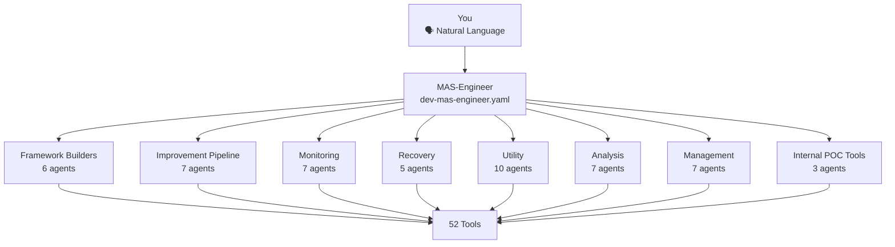
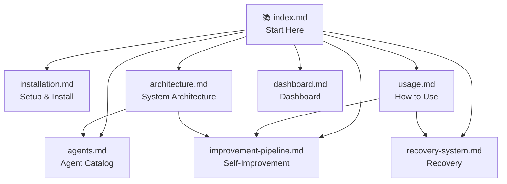

# MAS-Engineer

**Version:** v1.0.0  
**Sub-Agents:** 52  
**Tools:** 52 total (45 Python, 6 Shell, 1 YAML)

---

## What is MAS-Engineer?

MAS-Engineer is a **Goose-based Multi-Agent System generator** and **self-improving framework builder**. It helps you create, maintain, improve, monitor, and distribute multi-agent systems — all through natural language conversation.

You talk to the Engineer. The Engineer delegates to its 52 specialized sub-agents. This is a **proof of concept** demonstrating the architecture.

## Three Operating Modes

| Mode | `.mas-mode` | Use Case |
|------|------------|----------|
| **MAS** | `mas` | The Engineer improves ITSELF — analyzes its own sessions, optimizes its sub-agents, strengthens its rules |
| **Framework** | `framework` | The Engineer works on YOUR multi-agent system — scans, patches, hardens, improves |
| **Generic** | `<project>` | The Engineer creates a NEW project — initializes, generates agents, sets up infrastructure |

## Quick Start

```bash
# 1. Clone or unzip
git clone <repo> && cd mas-engineer

# 2. Install into Goose
./install.sh

# 3. Start Goose and select "dev-mas-engineer"
goose run --recipe recipe/dev-mas-engineer.yaml
```

## What You Can Do

| You Say | Engineer Delegates To | Result |
|---------|----------------------|--------|
| "Create a new multi-agent system" | `sub_mas-generic-init` | Lightweight project with symlinks + base agent |
| "Scan my system for issues" | `sub_mas-framework-scanner` | Framework analysis report |
| "Improve my agent's performance" | `sub_mas-general-improver` | 7-stage optimization pipeline |
| "Fix this agent's prompt" | `sub_mas-prompt-engineer` | Optimized prompt |
| "Show me the health status" | `sub_mas-monitor-*` | Health report |
| "Set up a dashboard" | Setup dashboard recipe | MCP dashboard app |
| "Deploy MAS-Engineer standalone" | `sub_mas-bootstrap` | Complete distribution with all 52 sub-agents |

## Architecture



## Key Concepts

- **R01 — User Confirmation**: Every write/edit/shell action requires explicit user approval
- **R18 — Delegation Duty**: If a sub-agent exists for the task, it MUST be used
- **R09 — Domain Separation**: MAS works in `mas-engineer/`, user frameworks in their own directory
- **R05 — Auto-Commit**: Every change is automatically committed + checkpointed + logged
- **R10 — Coronashield**: Every YAML is validated before storage

## Documentation Index



| Document | Description |
|----------|-------------|
| [installation.md](installation.md) | Install, update, uninstall |
| [architecture.md](architecture.md) | Complete system architecture |
| [usage.md](usage.md) | How to create, improve, monitor |
| [agents.md](agents.md) | Catalog of all 52 sub-agents |
| [improvement-pipeline.md](improvement-pipeline.md) | 7-stage self-improvement |
| [recovery-system.md](recovery-system.md) | 5-stage Phoenix recovery |
| [dashboard.md](dashboard.md) | Framework dashboard setup |
