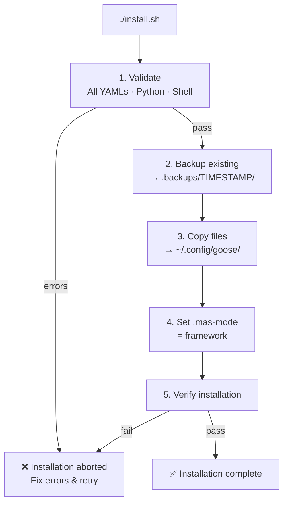
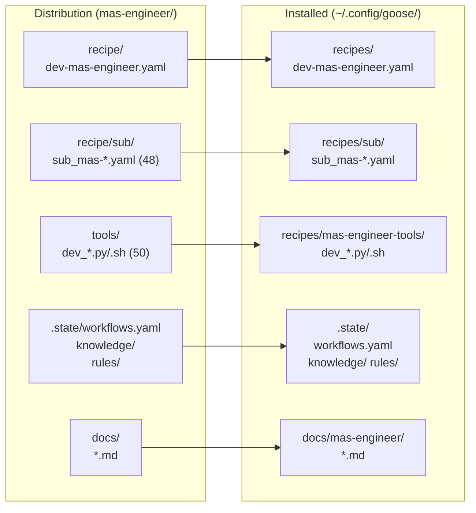

# Installation

## System Requirements

- **Goose** (Anthropic's MCP-based agent framework)
- **Python 3.10+** with `pyyaml`
- **Node.js 18+** (optional, for dashboard)
- **Git** (optional, for auto-commit)

## Install from Distribution

```bash
# 1. Unzip the distribution
unzip mas-framework-*.zip -d ~/mas-engineer

# 2. Install into Goose
cd ~/mas-engineer
./install.sh
```



The `install.sh` script:

1. **Validates** all YAMLs, Python files, and shell scripts
2. **Backs up** any existing installation to `.backups/TIMESTAMP/`
3. **Copies** files to `~/.config/goose/`:
   - Main recipe → `~/.config/goose/recipes/dev-mas-engineer.yaml`
   - 48 sub-agents → `~/.config/goose/recipes/sub/`
   - 50 tools → `~/.config/goose/recipes/mas-engineer-tools/`
   - Docs → `~/.config/goose/docs/mas-engineer/`
   - Knowledge + SOT → `~/.config/goose/.state/`
4. **Sets** `.mas-mode = framework`
5. **Validates** the installation

The installer auto-detects the directory structure:



```
Port-Modus (flat):                    Traditional:
mas-engineer/                         mas-engineer/
├── recipe/dev-mas-engineer.yaml      ├── recipe/dev-mas-engineer.yaml
├── recipe/sub/sub_mas-*.yaml         ├── recipe/sub/sub_mas-*.yaml
├── tools/dev_*.py                    ├── tools/dev_*.py
└── .state/workflows.yaml            └── .state/workflows.yaml
```

## Start MAS-Engineer

After installation, start Goose and select the recipe:

```bash
goose run --recipe dev-mas-engineer
```

Or from the project directory:

```bash
cd mas-engineer
goose run --recipe recipe/dev-mas-engineer.yaml
```

## Set Up the Dashboard (per Framework)

After creating a framework, set up its dashboard:

```bash
goose run --recipe recipe/setup-dashboard.yaml
```

This will:

1. Install npm dependencies in `.mas/mcp/`
2. Register a Goose extension in `~/.config/goose/config.yaml`
3. Set up a scheduler for data refresh (every 5 minutes)
4. Generate initial dashboard data

## Install a Bootstrap Distribution

To deploy MAS-Engineer as a standalone distribution:

```bash
goose run --recipe dev-mas-engineer
# Then tell the Engineer:
"Create a standalone distribution of MAS-Engineer named my-mas"
```

The Engineer delegates to `sub_mas-bootstrap` which copies all 48 agents, 50 tools, dashboard, and recovery templates into a new directory.

Then on the target machine:

```bash
cd my-mas
./install.sh
```

## Update

```bash
# Update MAS-Engineer itself
./update.sh --mas

# Update a user framework
./update.sh --framework
```

## Uninstall

Remove the MAS-Engineer files from Goose:

```bash
rm -rf ~/.config/goose/recipes/dev-mas-engineer.yaml
rm -rf ~/.config/goose/recipes/sub/sub_mas-*.yaml
rm -rf ~/.config/goose/recipes/mas-engineer-tools/
rm -rf ~/.config/goose/docs/mas-engineer/
```

## Status Check

```bash
./install.sh --status
```

Shows what's installed in the distribution vs what's in `~/.config/goose/`.
