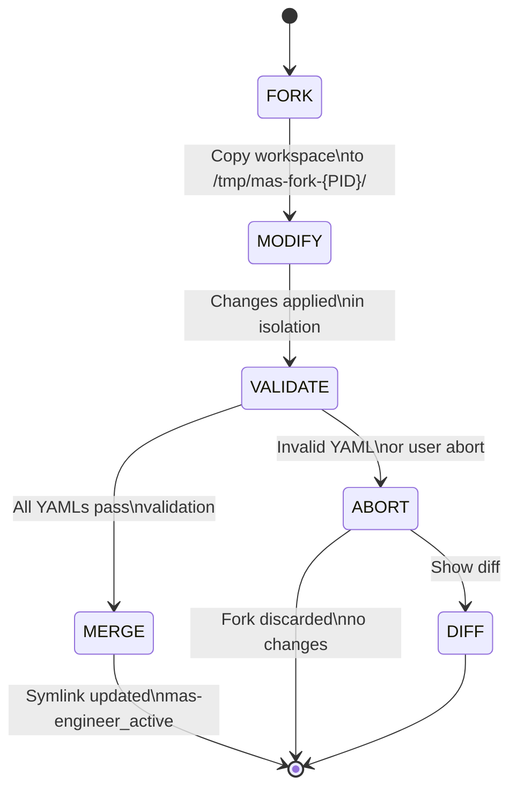
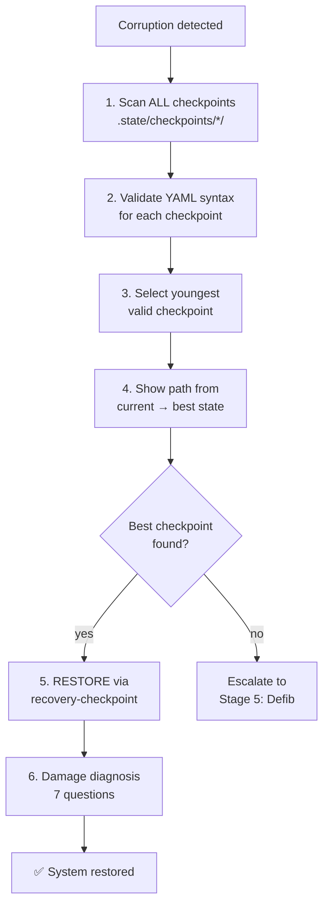
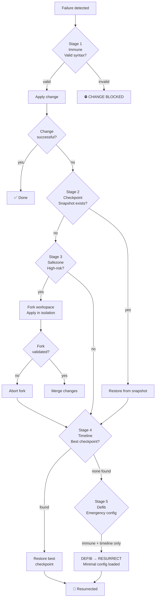

# Recovery System

MAS-Engineer features a **5-stage Phoenix Recovery** system. Each stage is a specialized sub-agent that handles a specific failure mode.

---

## Stage 1: Immune — Prevention

**Agent:** `sub_mas-recovery-immune`  
**Timeout:** 60s  
**Action:** BEFORE every change

The "Coronashield" — validates before anything can break:

- **YAML check**: `python3 -c "yaml.safe_load(open('file'))"`
- **Python check**: `python3 -c "compile(open('file').read(), 'file', 'exec')"`
- **Shell check**: `bash -n script.sh`
- **Recursive scan**: Validates ALL YAML files in the workspace

If a change would produce invalid YAML/Python/Shell → **BLOCKED**.

---

## Stage 2: Checkpoint — Snapshots

**Agent:** `sub_mas-recovery-checkpoint`  
**Timeout:** 120s  
**Action:** BEFORE and AFTER every change

Git-like snapshots in `.state/checkpoints/TIMESTAMP/`:

```
.state/checkpoints/20260622_143000/
├── recipe/sub/          # All sub-agent YAMLs
├── recipe/dev-mas-engineer.yaml
├── tools/               # All dev_*.py
├── docs/                # All documentation
├── .state/              # workflows.yaml, knowledge, rules
└── .label               # Checkpoint label
```

**Auto-commit after snapshot**: git add + git commit + changes.json update.

---

## Stage 3: Safezone — Fork Workspace

**Agent:** `sub_mas-recovery-safezone`  
**Timeout:** 300s  
**Action:** For high-risk changes



Creates a complete copy of the workspace:

1. **FORK**: Copies everything to a temporary directory
2. All changes happen ONLY in the fork
3. **MERGE only after full validation** (all YAMLs pass)
4. **ABORT** immediately discards the fork
5. **DIFF** shows what would change

The fork is tracked via a symlink: `mas-engineer_active → /tmp/mas-fork-{PID}/`

---

## Stage 4: Timeline — Best Point Search

**Agent:** `sub_mas-recovery-timeline`  
**Timeout:** 120s  
**Action:** When corruption is detected



Finds the best checkpoint automatically:

1. Scans ALL checkpoints in `.state/checkpoints/`
2. Validates YAML syntax for each checkpoint
3. Selects the **youngest valid** checkpoint
4. Shows the path from current state to best state
5. Delegates to `recovery-checkpoint` for RESTORE

**7-question damage diagnosis:**

| Questions | Damage Level |
|-----------|:-----------:|
| 0 errors | No damage |
| 1-2 errors | Partial corruption |
| 3-4 errors | Moderate corruption |
| 5-7 errors | Total failure |

---

## Stage 5: Defib — Emergency Revival

**Agent:** `sub_mas-recovery-defib`  
**Timeout:** 120s (minimal config)  
**Action:** When NOTHING works



The LAST resort. Loads a **minimal emergency config**:

```yaml
# dev-mas-engineer.yaml — minimal recovery config
sub_recipes:
  - name: sub_mas-recovery-immune
  - name: sub_mas-recovery-timeline
settings:
  timeout: 30
  max_steps: 10
```

This config only loads immune + timeline. Then:

1. **DEFIB**: Writes minimal config + validates
2. **RESURRECT**: Finds best checkpoint → restores
3. **DIAGNOSE**: Checks what's broken at 7 levels

---

## Recovery Flow

```
                 ┌─────────────────────┐
                 │  Change Requested   │
                 └──────────┬──────────┘
                            │
               ┌────────────▼────────────┐
               │  STAGE 1: Immune         │
               │  Validate syntax         │
               └────────────┬────────────┘
                            │ valid
               ┌────────────▼────────────┐
               │  STAGE 2: Checkpoint     │
               │  Create snapshot         │
               └────────────┬────────────┘
                            │
               ┌────────────▼────────────┐
               │     Apply Change        │
               └────────────┬────────────┘
                            │
              ┌─────────────▼─────────────┐
              │  Change OK?              │
              ├─────────────┬─────────────┤
              │     YES     │     NO      │
              ▼             ▼             │
        ┌──────────┐  ┌──────────┐       │
        │  Done    │  │ STAGE 3  │◄──────┘
        └──────────┘  │ Safezone│
                      │ Fork    │
                      └────┬────┘
                           │
              ┌────────────▼────────────┐
              │  STAGE 4: Timeline      │
              │  Find best checkpoint   │
              └────────────┬────────────┘
                           │
              ┌────────────▼────────────┐
              │  STAGE 5: Defib         │
              │  Emergency minimal      │
              └────────────┬────────────┘
                           │
              ┌────────────▼────────────┐
              │     Restored            │
              └─────────────────────────┘
```

---

## Recovery Agent Chain

```
MAS-Engineer
├── immune      (always active — prevents corruption)
├── checkpoint  (called before/after every change)
├── safezone    (called for high-risk changes)
├── timeline    (called when corruption detected)
│   └── checkpoint (delegate for restore)
└── defib       (last resort, calls timeline + checkpoint)
    ├── timeline (find best checkpoint)
    └── checkpoint (restore from checkpoint + snapshot after)
```

---

## Edge Cases Handled

| Scenario | Handling |
|----------|----------|
| No checkpoints exist | Fallback to `.backups/` directory |
| Backup is corrupt | Fallback to defib (minimal config) |
| defib also fails | "Totalschaden — reinstall via --init" |
| Concurrent access | Temporary files, locking |
| Disk full during snapshot | Error message → user decides |
| Immune check fails | Change BLOCKED → user notified |
