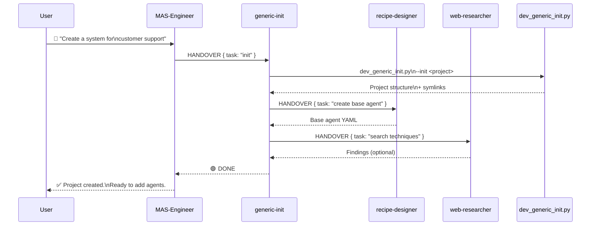
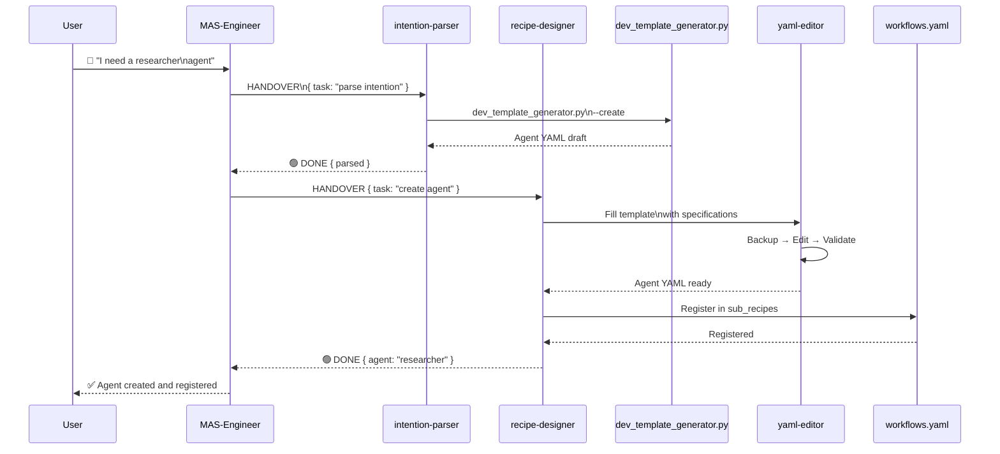
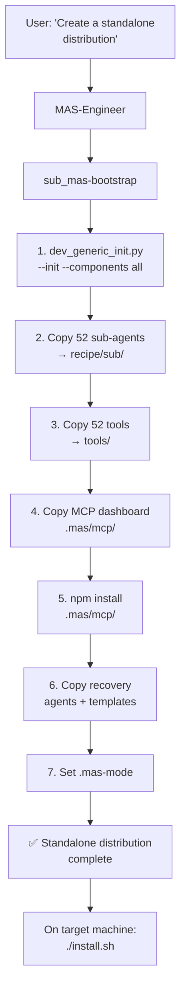
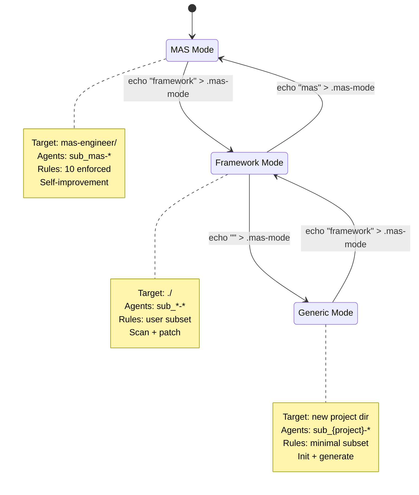

# Usage Guide

MAS-Engineer is operated through **natural language conversation**. You tell the Engineer what you want, and it delegates to the appropriate sub-agents.

---

## Starting a Session

```bash
goose run --recipe dev-mas-engineer
```

On first load, the Engineer:
1. Loads system knowledge (`sub_mas-system-knowledge`)
2. Detects the operating mode from `.mas-mode`
3. Says hello and asks what you'd like to do

---

## Creating a New Multi-Agent System



MAS delegates to `sub_mas-generic-init`, which:

1. Runs `dev_generic_init.py --init <project> --components <selection>`
2. Creates project structure with symlinks to MAS tools
3. Creates a base agent via `sub_mas-recipe-designer`
4. Sets up `.mas-mode`, `.goosehints`, guidelines
5. Optionally searches for current techniques via `sub_mas-web-researcher`

**Result:** A lightweight, symlink-based project in its own directory.

---

## Adding Agents to Your System



The `intention-parser`:
1. Detects intent from your description
2. Determines agent type (sub, full, internal)
3. Calls `dev_template_generator.py --create`

The `recipe-designer`:
1. Reads the agent template
2. Fills it with your specifications
3. Registers it in SOT and sub_recipes
4. Validates all YAMLs

---

## Improving Your System

**Dialog:**

```
You: "Improve my framework's agents"
Engineer: "I'll start the improvement pipeline..."

[delegates to sub_mas-general-improver → 7-stage pipeline]
```

The pipeline:
1. **Reads session data** (im-session-reader)
2. **Detects optimization potential** (im-finder — 53 documented patterns)
3. **Prioritizes findings** (im-rank — checks against Constitution)
4. **Designs patches** (im-designer)
5. **Shows you the patches** for approval
6. **Applies patches** (yaml-editor)
7. **Validates changes** (im-validator → prompt-engineer + agent-guardian)
8. **Pushes improvements** to your project

---

## Monitoring Your System

**Dialog:**

```
You: "How is my framework doing?"
Engineer: "I'll check the health..."

[delegates to sub_mas-agent-guardian + sub_mas-monitor-*]
```

Monitoring checks:
- Agent health (alive/degraded/dead)
- Schema compliance
- Drift detection (performance changes)
- Loop detection (repeated failures)
- Session anomalies

**Dialog:**

```
You: "Set up a dashboard"
Engineer: "Let me install the MCP dashboard app..."

[delegates to setup-dashboard.yaml]
```

---

## Repairing Your System

**Dialog:**

```
You: "Something broke, help me recover"
Engineer: "Let me check the damage..."
```

The 5-stage recovery activates automatically or on command:

1. **Immune**: Prevents corrupt YAML/Python/shell from being saved
2. **Checkpoint**: Restores from snapshots
3. **Safezone**: Works in an isolated fork
4. **Timeline**: Finds the best checkpoint automatically
5. **Defib**: Loads a minimal emergency config (immune + timeline only)

---

## Migrating Between Versions

**Dialog:**

```
You: "Migrate from v1.0.0 to v2.43.0"
Engineer: "Analyzing breaking changes..."

[delegates to sub_mas-migration-helper]
```

The migration helper:
1. Compares config.yaml, recipes, and docs between versions
2. Classifies BREAKING vs NON-BREAKING changes
3. Generates a migration plan with auto-fix and manual steps
4. Optional: executes the migration (with rollback on failure)

---

## Deploying MAS-Engineer Standalone



MAS delegates to `sub_mas-bootstrap`, which:
1. Runs `dev_generic_init.py --init --components all`
2. Copies all 52 sub-agents, main recipe, 52 tools
3. Copies dashboard MCP server (runs npm install)
4. Copies recovery templates and recovery agents
5. Sets `.mas-mode`
6. Optional: builds distribution ZIP

---

## Mode Switching

MAS-Engineer has 3 operating modes controlled by `.mas-mode`:



The user switches modes by changing `.mas-mode`:

```bash
echo "mas" > .mas-mode
echo "framework" > .mas-mode
echo "my-project" > .mas-mode
```

The mode is auto-detected at startup and affects:
- Target workspace (MAS → `mas-engineer/`, Framework → `./`)
- Agent naming (sub_mas-* vs sub_{project}-*)
- Which rules are active
- Which agents are available

---

## Web Research

Before creating or improving a framework, the Engineer asks:

```
"Should I search for current techniques via sub_mas-web-researcher?"
```

If yes, `sub_mas-web-researcher` searches:
- **goose-docs.ai** — Goose-specific techniques
- **GitHub** — Open-source multi-agent frameworks
- **PyPI** — Python packages for MAS

Findings are presented with relevance ratings (High/Medium/Info) and the user decides which to integrate.

---

## Session Tagging

For the improvement pipeline to work correctly, tag your sessions:

```
[{project_name}] My analysis session
```

The tag is set in `.goosehints` during initialization:
```bash
GOOSE_SESSION_TAG=<project_name>
```

This ensures the im-session-reader only processes sessions belonging to your project.
